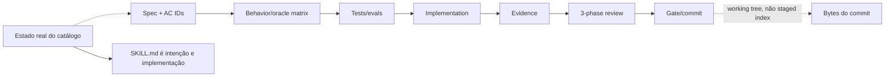
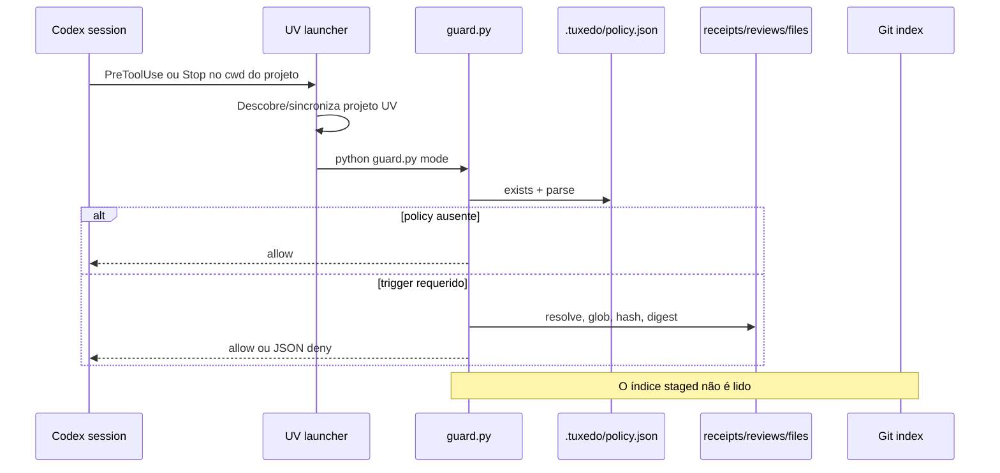
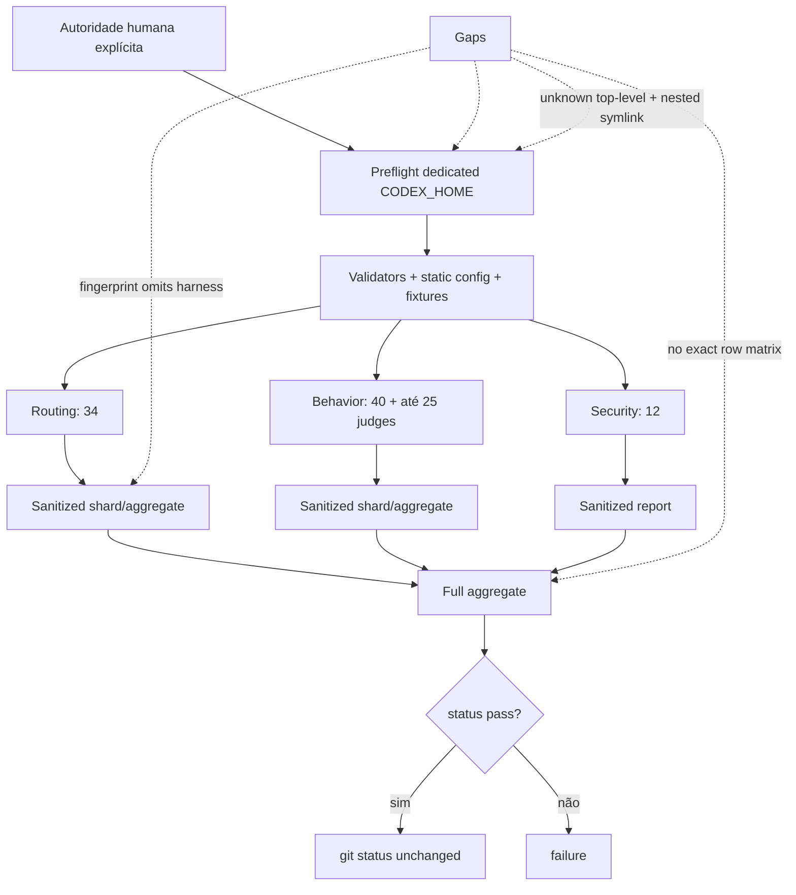
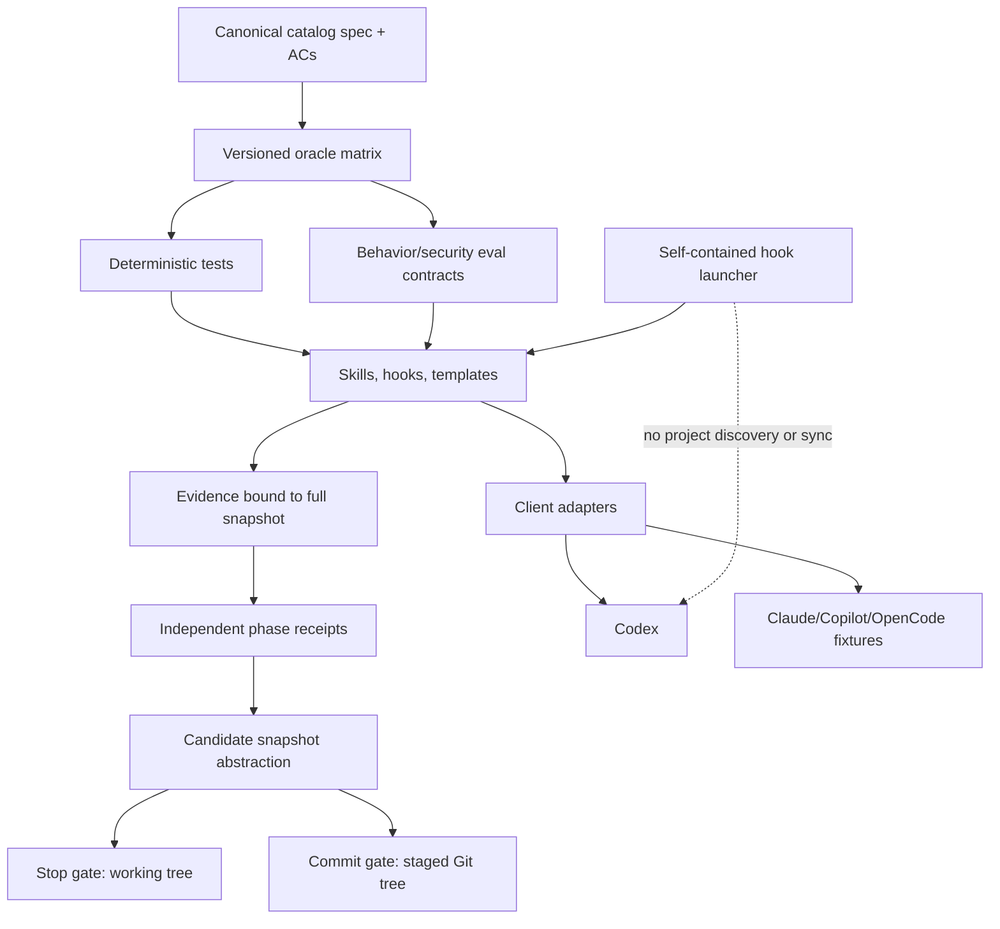

# 03 — Produto, arquitetura e contratos

## Produto e escopo

### Fato observado

`README.md:3-20` e `docs/development.md:7-11` apresentam o Tuxedo como toolkit portátil, spec-driven, orientado a agentes e composto pelo repositório, sem CLI, daemon, package manager, sync, telemetry, generator ou runtime dependency. O manifest (`.codex-plugin/plugin.json:1-12`) distribui o plugin; `skills/` contém o core portável; `agents/openai.yaml`, `hooks/` e `templates/codex/` isolam comportamento Codex; `evals/`, testes e dependências são de mantenedor.

### Interpretação

O modelo mental é forte: conteúdo declarativo instalado, integração opcional por cliente e infraestrutura de validação fora do artefato consumido. Não foi encontrada maquinaria acidental de CLI/runtime na superfície distribuída. Promptfoo e Codex SDK aparecem apenas em dev tooling.

### Limite

“Portátil” é verdadeiro no sentido de formato e neutralidade textual; não está comprovado no sentido de instalação, descoberta, routing e composição nos clientes alegados (`TUX-AUD-011`). “Sem runtime dependency” é verdadeiro para o conteúdo das skills, mas falso para a operação atual dos hooks porque o launcher usa UV no projeto consumidor (`TUX-AUD-002`).

## Arquitetura atual

### Boundaries confirmados

- O core das skills não referencia Promptfoo/Codex SDK.
- Integração OpenAI está em `agents/openai.yaml`; lifecycle está em `hooks/`.
- Rules e policy são templates de adoção, não mutações automáticas do projeto.
- `evals/` e `node_modules/` não fazem parte do conteúdo instalado.
- Assets necessários a `spec` e `verify` são autocontidos no pacote da skill.

### Acoplamentos problemáticos

- `hooks/hooks.json` acopla o lifecycle a UV e, por cwd, ao projeto consumidor.
- O receipt acopla implementação, testes, docs e reviews por hashes, mas não ao índice Git nem a IDs de critérios.
- O fingerprint de eval acopla identidade apenas a `AGENTS.md + skills/**`, enquanto o verdict depende também de tasks, fixtures, configs, assertions, runner, provider e lockfile.
- A mesma behavior matrix tem ownership simultâneo em `spec` e `verify`, sem state machine de transição.

## Cadeia de fidelidade declarada e real

`AGENTS.md:7-17` exige a sequência, IDs estáveis, classificação de evidência e três fases. Os templates representam o formato. Porém, `git ls-files` não contém spec ou AC real do catálogo, behavior matrix do produto, evidence artifact ou review receipt. A implementação (o texto da skill) é também a principal fonte de intenção. Isso impede reconstruir fase 1 sem contaminação e constitui `TUX-AUD-001`.

## Fluxo de enforcement

O guard usa apenas stdlib, canonical JSON e SHA-256; bloqueia traversal de artifacts e detecta hashes stale. Esses são pontos fortes reais. A força documental excede o mecanismo em quatro pontos: UV roda antes do guard; policy symlinks/tipos inesperados não falham pelo protocolo correto; roles podem aliasar; e o commit candidate não é o staged snapshot.

## Fluxo das evals

O desenho de isolamento, state temporário, checkpointing após exit 100, reports sanitizados e continuação de suites após assertion failure é sólido. Os findings `TUX-AUD-005` a `TUX-AUD-009` mostram que identidade, isolamento, cobertura e o caminho legado ainda não satisfazem o contrato.

## Enforcement determinístico versus julgamento

| Claim | Mecanismo real | Força legítima |
| --- | --- | --- |
| Artifact não mudou | SHA-256 sobre arquivo da working tree | Forte para bytes lidos naquele instante. |
| Tree está completa | glob + comparação exata de paths/hashes | Forte para policy e cwd atuais; sensível a overlap/symlink/race. |
| Critérios estão cobertos | Um par global fail-first/passing | Insuficiente; não há AC IDs. |
| Revisões foram independentes | Booleans declarados + hashes | Declaração de contexto, não independência real; validação incompleta. |
| Commit contém bytes revisados | Nenhuma leitura do índice | Não garantido. |
| Skill foi usada | metadata/`skill-used` | Heurística do provider. |
| Patch atende oracle | AST/filesystem checks | Forte para o fixture específico. |
| Segurança foi preservada | Frozen probes + canary/trajectory | Diagnóstico limitado; falsos negativos confirmados. |
| Full cobriu 86 trials | Soma de rows presentes | Não garantido sem matriz/cardinalidade. |

## Arquitetura recomendada

Mudanças essenciais:

1. tornar spec/matriz do catálogo canônicas e versionadas;
2. separar `candidate snapshot` de working tree e staged index;
3. executar hooks em runtime autocontido/isolado do projeto consumidor;
4. tornar policy parsing fail-closed por protocolo;
5. dar identidade versionada a todas as entradas/oráculos das evals;
6. validar conjunto exato de rows e reduzir claims dos probes ao que o oracle detecta;
7. definir state machine de composição das skills e adapters/install fixtures por cliente.

## Sustentabilidade e reversibilidade

A base é pequena e reversível: skills são arquivos, hooks são opt-in e o toolchain é dev-only. Os maiores custos futuros vêm de duplicações manuais e da ausência de ownership explícito, não de volume de código. Os work packages mantêm correções independentes: hook launcher, staged binding, policy parsing e eval validity podem avançar paralelamente depois que o contrato canônico define os fatos que cada mecanismo deve provar.
