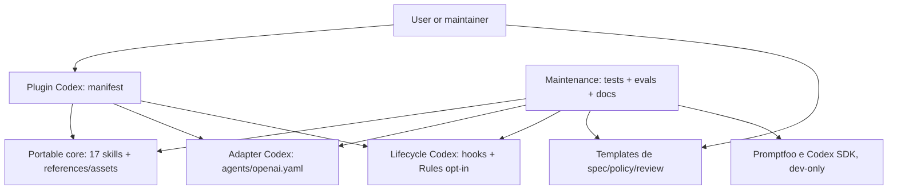
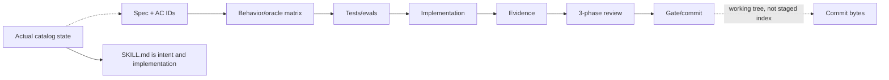
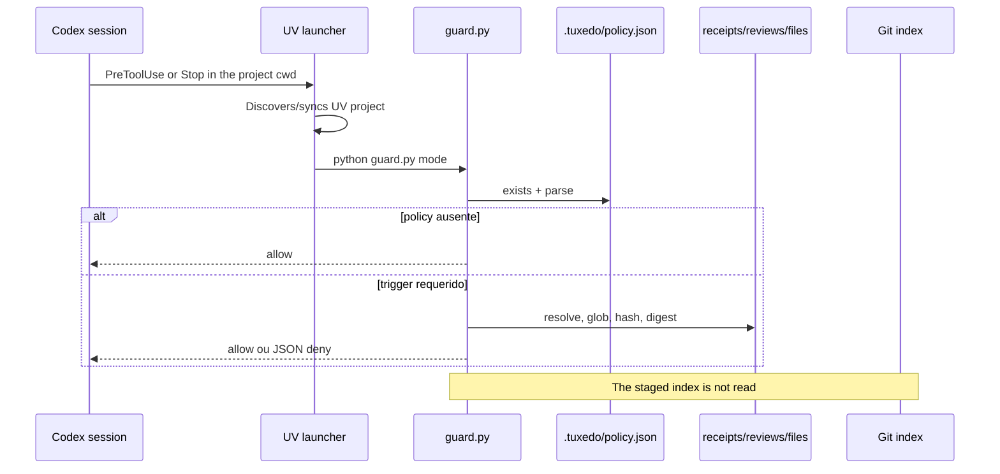
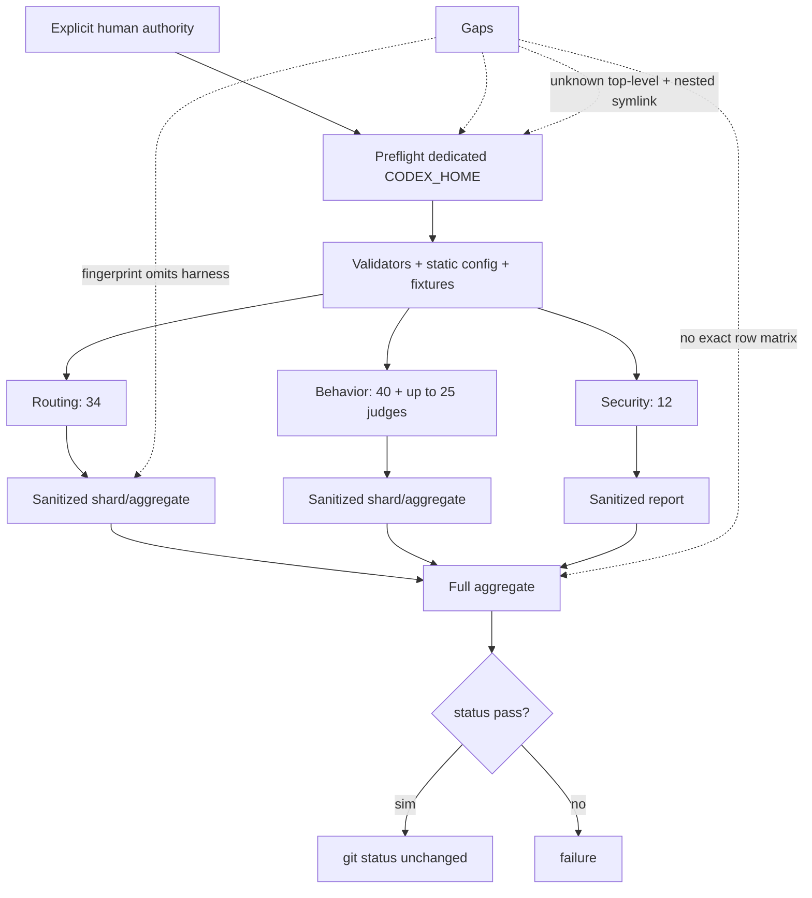
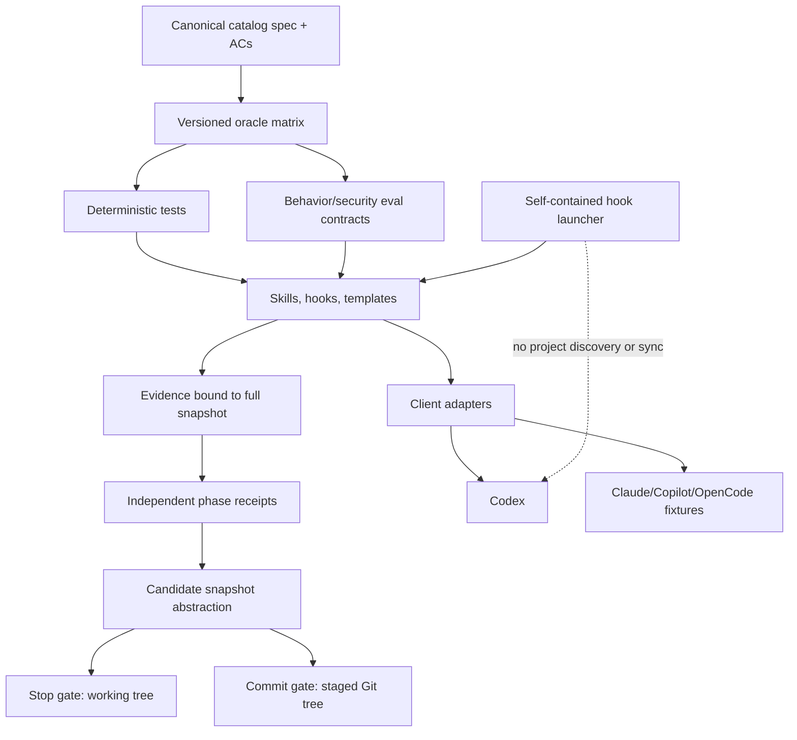

# 03 — Product, architecture, and contracts

## Product and scope

### Observed fact

`README.md:3-20` and `docs/development.md:7-11` present Tuxedo as a portable, spec-driven, agent-oriented toolkit composed of the repository, with no CLI, daemon, package manager, sync, telemetry, generator, or runtime dependency. The manifest (`.codex-plugin/plugin.json:1-12`) distributes the plugin; `skills/` contains the portable core; `agents/openai.yaml`, `hooks/`, and `templates/codex/` isolate Codex behavior; `evals/`, tests, and dependencies are maintainer-only.

### Interpretation

The mental model is strong: installed declarative content, optional per-client integration, and validation infrastructure outside the consumed artifact. No accidental CLI/runtime machinery was found in the distributed surface. Promptfoo and the Codex SDK appear only in dev tooling.

### Limit

“Portable” is true in the sense of format and textual neutrality; it is not proven in the sense of installation, discovery, routing, and composition in the claimed clients (`TUX-AUD-011`). “No runtime dependency” is true for skill content, but false for the current hook operation because the launcher uses UV in the consumer project (`TUX-AUD-002`).

## Current architecture

### Confirmed boundaries

- The skill core does not reference Promptfoo/the Codex SDK.
- OpenAI integration is in `agents/openai.yaml`; lifecycle is in `hooks/`.
- Rules and policy are adoption templates, not automatic project mutations.
- `evals/` and `node_modules/` are not part of installed content.
- Assets required by `spec` and `verify` are self-contained in the skill package.

### Problematic couplings

- `hooks/hooks.json` couples lifecycle to UV and, through cwd, to the consumer project.
- The receipt couples implementation, tests, docs, and reviews by hashes, but not to the Git index or criterion IDs.
- The eval fingerprint binds identity only to `AGENTS.md + skills/**`, while the verdict also depends on tasks, fixtures, configs, assertions, runner, provider, and lockfile.
- The same behavior matrix has simultaneous ownership in `spec` and `verify`, without a transition state machine.

## Declared and actual fidelity chain

`AGENTS.md:7-17` requires the sequence, stable IDs, evidence classification, and three phases. The templates represent the format. However, `git ls-files` contains no actual catalog spec or AC, product behavior matrix, evidence artifact, or review receipt. The implementation (the skill text) is also the primary source of intent. This prevents reconstructing phase 1 without contamination and constitutes `TUX-AUD-001`.

## Enforcement flow

The guard uses only stdlib, canonical JSON, and SHA-256; it blocks artifact traversal and detects stale hashes. These are real strengths. The documentary strength exceeds the mechanism in four areas: UV runs before the guard; policy symlinks/unexpected types do not fail according to the correct protocol; roles may alias; and the commit candidate is not the staged snapshot.

## Eval flow

The design of isolation, temporary state, checkpointing after exit 100, sanitized reports, and continuation of suites after assertion failure is solid. Findings `TUX-AUD-005` through `TUX-AUD-009` show that identity, isolation, coverage, and the legacy path still do not satisfy the contract.

## Deterministic enforcement versus judgment

| Claim | Actual mechanism | Legitimate strength |
| --- | --- | --- |
| Artifact did not change | SHA-256 over a working-tree file | Strong for bytes read at that instant. |
| Tree is complete | glob + exact path/hash comparison | Strong for current policy and cwd; sensitive to overlap/symlink/race. |
| Criteria are covered | One global fail-first/passing pair | Insufficient; there are no AC IDs. |
| Reviews were independent | Declared booleans + hashes | Context declaration, not actual independence; incomplete validation. |
| Commit contains reviewed bytes | No index read | Not guaranteed. |
| Skill was used | metadata/`skill-used` | Provider heuristic. |
| Patch satisfies oracle | AST/filesystem checks | Strong for the specific fixture. |
| Security was preserved | Frozen probes + canary/trajectory | Limited diagnostic; confirmed false negatives. |
| Full covered 86 trials | Sum of present rows | Not guaranteed without a matrix/cardinality. |

## Recommended architecture

Essential changes:

1. make the catalog spec/matrix canonical and versioned;
2. separate the `candidate snapshot` from the working tree and staged index;
3. run hooks in a self-contained runtime isolated from the consumer project;
4. make policy parsing fail-closed by protocol;
5. give all eval entries/oracles versioned identity;
6. validate the exact row set and reduce probe claims to what the oracle detects;
7. define a state machine for skill composition and per-client adapter/install fixtures.

## Sustainability and reversibility

The foundation is small and reversible: skills are files, hooks are opt-in, and the toolchain is dev-only. The largest future costs come from manual duplication and the absence of explicit ownership, not code volume. The work packages keep fixes independent: hook launcher, staged binding, policy parsing, and eval validity can proceed in parallel once the canonical contract defines the facts each mechanism must prove.
