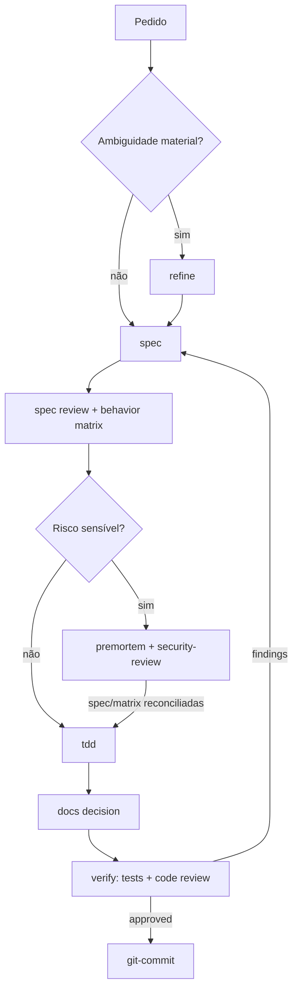
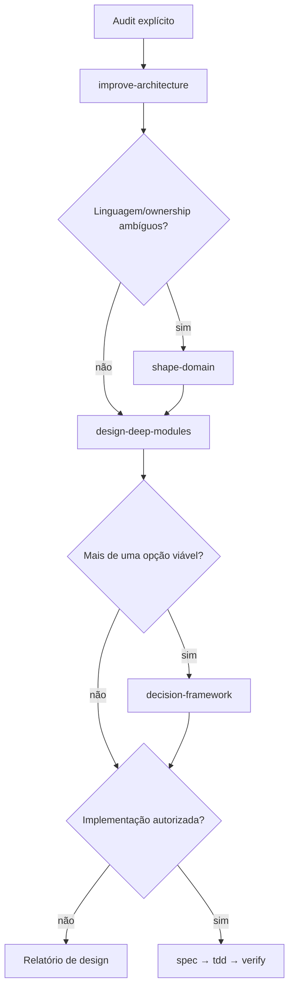
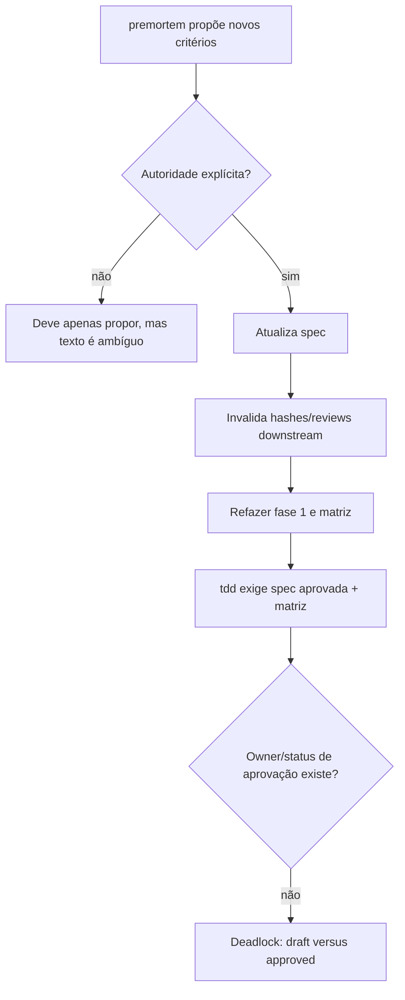

# 04 — Skills, agentes e documentação

## Resultado do catálogo

As 17 skills foram revisadas individualmente e passaram no validator oficial. Seus `SKILL.md` são concisos, imperativos, client-neutral e usam referências locais com profundidade máxima de um nível. A integração Codex está corretamente em `agents/openai.yaml`; não há dependência de Promptfoo/Codex SDK no conteúdo instalado. Assets de `spec`/`verify` tornam os fluxos centrais autocontidos.

O problema sistêmico não é qualidade textual, mas ausência de contrato/lifecycle do catálogo: não há precedência global, owner de transição `draft → reviewed → approved`, nem fallback quando uma skill não está instalada. O routing explícito é medido somente no layout Codex; behavior cobre sete skills (`docs/architecture/evaluations.md:180-195`).

## Matriz de todas as skills

| Skill | Routing/overlap | Autoridade e stop | Portabilidade | Referências/assets | Avaliação |
| --- | --- | --- | --- | --- | --- |
| `brainstorming` | Explicit-only; precede `refine` quando a intenção ainda é aberta | Não implementa sem autorização; para em intenção estabilizada | Forte | Nenhum | Coerente; saída é semântica, mas clara. |
| `bugfix` | Defeito existente; compõe com `tdd`, `security-review`, `verify` | Correção causal cabe ao pedido; “reconcile spec” não repete autorização | Forte | `feedback-loops.md` | Risco moderado de editar input governante em instalação standalone. |
| `ci-workflow` | CI/build/release/deploy; overlap com security | Release/deploy protegidos; skill desenha/revisa | Boa, dependente da CI alvo | Nenhum | Trigger mais amplo que a ação; composição não formalizada. |
| `decision-framework` | Alternativas após refinement; overlap com design/premortem | Decide apenas no escopo autorizado | Forte | `evidence-types.md` | Falta precedência quando `refine` ainda tem decisão aberta. |
| `design-deep-modules` | Boundary/API; distinto de audit amplo | Spec só muda com autoridade; implementação ambígua | Forte; Mermaid portátil | `boundary-options.md` | Pode circular com `shape-domain`/architecture sem stop global. |
| `docs` | Docs duráveis; vocabulário vai a `shape-domain` | Menor superfície autorizada | Forte | 3 refs | Compacta; poucos exemplos de falha operacional. |
| `git-commit` | Commit local verificado; implicit elegível | Limites Git/release fortes | Git necessário; nome genérico | Nenhum | Boa autoridade; colisão cross-client e receipt staged gap. |
| `improve-architecture` | Audit amplo explicit-only; delega boundary | Proíbe alteração de produção sem nova autoridade | Forte | `architecture-diagrams.md` | Boundary excelente. |
| `premortem` | Risco médio/alto; overlap com spec/security | Pode mandar adicionar critérios quando “justified”, sem repetir autoridade | `openai.yaml` implicit por default, diverge do README | Nenhum | `TUX-AUD-013` e `TUX-AUD-015`. |
| `refine` | Ambiguidade material; precedência com brainstorming | Escreve somente artefato autorizado | Forte | `decision-tree.md` | Pode bloquear TDD sem owner de aprovação. |
| `security-review` | Trust boundary/sensitive/destructive | Review-only; não promete garantia | Forte e neutra | `threat-model.md` | Honesta; remediação stack-specific fica fora. |
| `session-bridge` | Explicit-only | Sem escrita; saída estruturada | Forte | `handoff-template.md` | Coerente e honesta sobre contexto. |
| `shape-domain` | Vocabulário/ownership comportamental | Só atualiza superfície autorizada | Forte | `context-mapping.md` | Pode formar ciclo com docs/design. |
| `spec` | Mudança material antes de implementação | Proteção forte de input governante | Forte | 3 refs, 2 assets | Defaults `small`/single reviewer enviesam classificação. |
| `tdd` | Implementação com AC/matriz estáveis | Para em conflito | Forte; requer runner alvo | `provenance.md` | “Approved behavior” sem lifecycle/owner. |
| `technical-research` | Standards/APIs/claims atuais | Só atualiza spec quando autorizado | Rede/tool ausente; implicit default | `source-quality.md` | `TUX-AUD-013` e `TUX-AUD-029`. |
| `verify` | Review/completion boundary | Reparos e escrita só autorizados | Forte; reconstrói fases | 2 refs, 4 assets | Divide ownership da matrix com `spec`. |

## Routing e metadados OpenAI

Todos os 17 `agents/openai.yaml` têm metadata parseável e descrição consistente com o respectivo `SKILL.md`. Os cinco explicit-only observados — por exemplo `brainstorming`, `improve-architecture` e `session-bridge` — usam `allow_implicit_invocation: false`. `premortem` e `technical-research` não o fazem, apesar do README classificar deep work como explicitamente invocado (`README.md:24-31`), criando `TUX-AUD-013`.

As descrições geralmente têm positive e negative scope, o que reduz falsos positivos. Os nomes `docs`, `spec`, `verify` e `bugfix` são genéricos; a documentação oficial do Codex informa que skills homônimas não são mescladas. Sem namespace/fixture de colisão cross-client, há risco de shadowing (`TUX-AUD-026`).

## Portabilidade

### Confirmado

- O formato usa apenas o denominador comum Agent Skills: frontmatter, Markdown, references e assets.
- Não há invocações Codex-specific dentro do core das skills.
- O diretório `agents/` encapsula políticas OpenAI.
- As referências são relativas e autocontidas.

### Não comprovado

O checkout contém `skills/`, adequado como conteúdo do plugin, mas não os layouts auto-descobertos por Codex standalone, Copilot, Claude Code ou OpenCode. O README não fornece instalação por cliente, matriz de suporte ou fixture clean-room. As evals admitem explicitamente medir somente `.agents/skills/` do Codex e sete skills de behavior. Portanto, o claim deve significar “compatível em formato” até que `TUX-AUD-011` seja resolvido.

## Instruction architecture de `AGENTS.md`

### Pontos fortes

- Escopo negativo claro: sem runtime/distribution machinery.
- Tier por boundary, não por line count (`AGENTS.md:19-28`).
- Autoridade separada de evidência e qualidade semântica (`AGENTS.md:30-39`).
- Toolchain UV/PNPM e proibição de eval paga automática.
- Definição explícita de o que hooks não podem provar.
- Completion ligada a comandos frescos e risco residual.

### Tensões

- Exige spec/matriz/receipts para toda mudança material, mas o próprio repositório não conserva esses artefatos (`TUX-AUD-001`).
- “Quando reviewers independentes estão disponíveis” é verificável apenas por declaração; hashes não provam independência.
- O volume é administrável, mas skills standalone não herdam automaticamente a proteção do `AGENTS.md`; cada skill que sugere escrita sensível precisa repetir a fronteira essencial.
- A exigência de commit local em slices é política de mantenedor, não portável; está corretamente fora do core, mas `git-commit` implicit pode ser selecionada em clientes com regras diferentes.

## Composição — cenário normal

O fluxo acima é uma arquitetura recomendada inferida dos contratos, não uma state machine versionada no produto. Isso precisa ser tornado explícito em `WP-09`.

## Composição — arquitetura e domínio

## Falhas e deadlocks possíveis

Outros deadlocks/loops:

- `shape-domain → docs → design-deep-modules → shape-domain` sem owner da decisão.
- `verify → spec` em qualquer finding sem regra de severidade pode reiniciar o ciclo inteiro.
- Stop hook com policy impossível/receipt stale pode pedir continuação repetida; `stop_hook_active` não é usado.
- Skill ausente no cliente não tem fallback contratual; o agente pode improvisar a etapa.

## Templates e outputs das skills

Os outputs de `spec` e `verify` representam ACs, oracles, evidence e reviews com boa separação visual. No entanto:

- `risk: small` e `single-isolated-reviewer` são defaults resolvidos, não placeholders (`TUX-AUD-016`);
- não há state transition de `draft` para aprovado;
- os pares root/skill são cópias sem fonte canônica declarada (`TUX-AUD-028`);
- a separação estrutural pode ser anulada pelo receipt apontando três roles para um arquivo (`TUX-AUD-017`).

## Documentação e onboarding

### Pontos fortes

- README curto e separa usuário de mantenedor.
- Hub `docs/README.md` encontra arquitetura, ADR, research, guides e evidence.
- Eval docs registram limitações importantes: mesma família de judge, modelo não resolvido, routing explícito, 7/17 behavior e security não universal (`docs/architecture/evaluations.md:180-195`).
- O evidence map separa empirical, heuristic, product decision e community inspiration.
- Links internos rastreados: zero broken.

### Lacunas

- “Add it to a local Codex marketplace” não fornece comando, manifest de marketplace, restart, confirmação, update ou removal (`TUX-AUD-012`).
- Não há guia equivalente por cliente (`TUX-AUD-011`).
- O único ledger detalhado Geremmyas é ignorado e pessoal (`TUX-AUD-024`).
- Bibliografia não registra URL direta, data, hash, página/seção ou método (`TUX-AUD-027`).
- Python mínimo e o SDK efetivo do provider não são documentados corretamente (`TUX-AUD-022`, `TUX-AUD-023`).

## Critério de melhoria

O catálogo estará documentalmente sustentável quando outro mantenedor puder, de um clone limpo: instalar o plugin e uma skill standalone em cada cliente suportado; prever a skill/ordem/stop para cenários compostos; localizar o AC que justifica cada contrato; executar validators e fixtures; e reproduzir a proveniência sem paths, memória ou arquivos ignorados pessoais.
