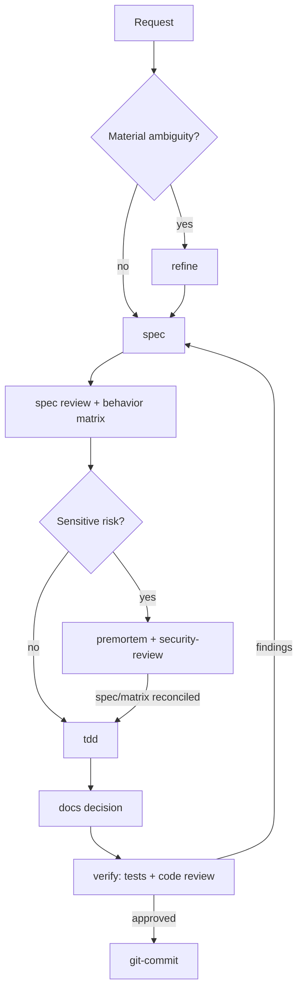
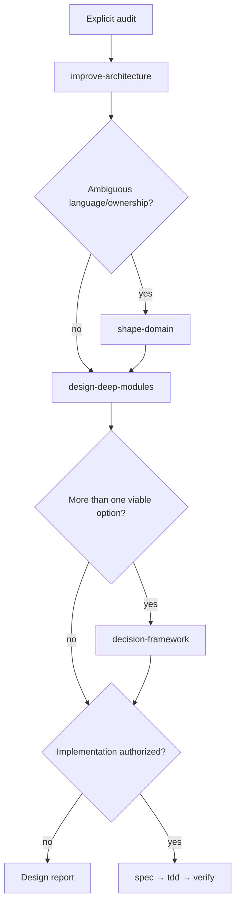
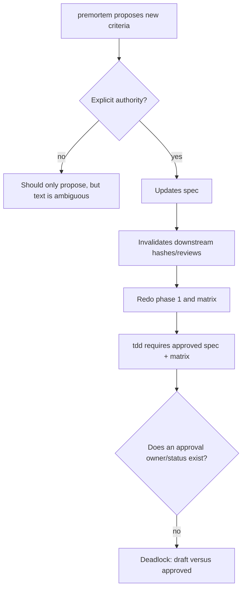

# 04 — Skills, agents, and documentation

## Catalog result

All 17 skills were reviewed individually and passed the official validator. Their `SKILL.md` files are concise, imperative, client-neutral, and use local references with a maximum depth of one level. Codex integration is correctly in `agents/openai.yaml`; installed content has no Promptfoo/Codex SDK dependency. `spec`/`verify` assets make the central workflows self-contained.

The systemic problem is not textual quality, but the absence of a catalog contract/lifecycle: there is no global precedence, owner for the `draft → reviewed → approved` transition, or fallback when a skill is not installed. Explicit routing is measured only in the Codex layout; behavior covers seven skills (`docs/architecture/evaluations.md:180-195`).

## Matrix of all skills

| Skill | Routing/overlap | Authority and stop | Portability | References/assets | Assessment |
| --- | --- | --- | --- | --- | --- |
| `brainstorming` | Explicit-only; precedes `refine` while intent remains open | Does not implement without authorization; stops once intent is stabilized | Strong | None | Coherent; output is semantic but clear. |
| `bugfix` | Existing defect; composes with `tdd`, `security-review`, `verify` | Causal fix belongs to the request; “reconcile spec” does not repeat authorization | Strong | `feedback-loops.md` | Moderate risk of editing governing input in standalone installation. |
| `ci-workflow` | CI/build/release/deploy; overlaps security | Release/deploy protected; skill designs/reviews | Good, dependent on target CI | None | Trigger is broader than the action; composition is not formalized. |
| `decision-framework` | Alternatives after refinement; overlaps design/premortem | Decides only within authorized scope | Strong | `evidence-types.md` | No precedence when `refine` still has an open decision. |
| `design-deep-modules` | Boundary/API; distinct from broad audit | Spec changes only with authority; implementation is ambiguous | Strong; portable Mermaid | `boundary-options.md` | May cycle with `shape-domain`/architecture without a global stop. |
| `docs` | Durable docs; vocabulary goes to `shape-domain` | Smallest authorized surface | Strong | 3 refs | Compact; few operational failure examples. |
| `git-commit` | Verified local commit; eligible for implicit invocation | Strong Git/release boundaries | Git required; generic name | None | Good authority; cross-client collision and staged receipt gap. |
| `improve-architecture` | Broad audit, explicit-only; delegates boundary work | Prohibits production changes without new authority | Strong | `architecture-diagrams.md` | Excellent boundary. |
| `premortem` | Medium/high risk; overlaps spec/security | May direct criteria to be added when “justified,” without repeating authority | `openai.yaml` implicit by default, diverges from README | None | `TUX-AUD-013` and `TUX-AUD-015`. |
| `refine` | Material ambiguity; precedence with brainstorming | Writes only an authorized artifact | Strong | `decision-tree.md` | May block TDD without an approval owner. |
| `security-review` | Trust boundary/sensitive/destructive | Review-only; does not promise a guarantee | Strong and neutral | `threat-model.md` | Honest; stack-specific remediation stays out. |
| `session-bridge` | Explicit-only | No writing; structured output | Strong | `handoff-template.md` | Coherent and honest about context. |
| `shape-domain` | Vocabulary/behavioral ownership | Updates only an authorized surface | Strong | `context-mapping.md` | May form a cycle with docs/design. |
| `spec` | Material change before implementation | Strong protection for governing input | Strong | 3 refs, 2 assets | `small`/single-reviewer defaults bias classification. |
| `tdd` | Implementation with stable AC/matrix | Stops on conflict | Strong; requires target runner | `provenance.md` | “Approved behavior” without lifecycle/owner. |
| `technical-research` | Current standards/APIs/claims | Updates spec only when authorized | Network/tool absent; implicit default | `source-quality.md` | `TUX-AUD-013` and `TUX-AUD-029`. |
| `verify` | Review/completion boundary | Repairs and writing only when authorized | Strong; reconstructs phases | 2 refs, 4 assets | Shares matrix ownership with `spec`. |

## Routing and OpenAI metadata

All 17 `agents/openai.yaml` files have parseable metadata and descriptions consistent with their respective `SKILL.md`. The five observed explicit-only skills — for example `brainstorming`, `improve-architecture`, and `session-bridge` — use `allow_implicit_invocation: false`. `premortem` and `technical-research` do not, although the README classifies deep work as explicitly invoked (`README.md:24-31`), creating `TUX-AUD-013`.

Descriptions generally include positive and negative scope, which reduces false positives. The names `docs`, `spec`, `verify`, and `bugfix` are generic; official Codex documentation says same-named skills are not merged. Without a cross-client namespace/collision fixture, there is a shadowing risk (`TUX-AUD-026`).

## Portability

### Confirmed

- The format uses only the Agent Skills common denominator: frontmatter, Markdown, references, and assets.
- There are no Codex-specific invocations inside the skill core.
- The `agents/` directory encapsulates OpenAI policies.
- References are relative and self-contained.

### Unproven

The checkout contains `skills/`, suitable as plugin content, but not the auto-discovered layouts for standalone Codex, Copilot, Claude Code, or OpenCode. The README provides no per-client installation, support matrix, or clean-room fixture. The evals explicitly allow measurement of only Codex `.agents/skills/` and seven behavior skills. Therefore, the claim must mean “format-compatible” until `TUX-AUD-011` is resolved.

## `AGENTS.md` instruction architecture

### Strengths

- Clear negative scope: no runtime/distribution machinery.
- Tier by boundary, not line count (`AGENTS.md:19-28`).
- Authority separated from evidence and semantic quality (`AGENTS.md:30-39`).
- UV/PNPM toolchain and prohibition on automatic paid evals.
- Explicit definition of what hooks cannot prove.
- Completion tied to fresh commands and residual risk.

### Tensions

- It requires a spec/matrix/receipts for every material change, but the repository itself does not retain those artifacts (`TUX-AUD-001`).
- “When independent reviewers are available” is verifiable only by declaration; hashes do not prove independence.
- The volume is manageable, but standalone skills do not automatically inherit `AGENTS.md` protection; each skill that suggests sensitive writing must repeat the essential boundary.
- The local commit-in-slices requirement is maintainer policy, not portable; it is correctly outside the core, but implicit `git-commit` may be selected in clients with different rules.

## Composition — normal scenario

The flow above is a recommended architecture inferred from the contracts, not a versioned state machine in the product. This needs to be made explicit in `WP-09`.

## Composition — architecture and domain

## Possible failures and deadlocks

Other deadlocks/loops:

- `shape-domain → docs → design-deep-modules → shape-domain` without a decision owner.
- `verify → spec` on any finding without a severity rule can restart the entire cycle.
- A stop hook with impossible policy/stale receipt may request repeated continuation; `stop_hook_active` is not used.
- A skill missing from the client has no contractual fallback; the agent may improvise the step.

## Skill templates and outputs

The `spec` and `verify` outputs represent ACs, oracles, evidence, and reviews with good visual separation. However:

- `risk: small` and `single-isolated-reviewer` are resolved defaults, not placeholders (`TUX-AUD-016`);
- there is no state transition from `draft` to approved;
- root/skill pairs are copies without a declared canonical source (`TUX-AUD-028`);
- structural separation can be nullified by a receipt pointing three roles to one file (`TUX-AUD-017`).

## Documentation and onboarding

### Strengths

- Short README separates user and maintainer audiences.
- `docs/README.md` hub locates architecture, ADR, research, guides, and evidence.
- Eval docs record important limitations: same judge family, unresolved model, explicit routing, 7/17 behavior, and non-universal security (`docs/architecture/evaluations.md:180-195`).
- The evidence map separates empirical, heuristic, product decision, and community inspiration.
- Tracked internal links: zero broken.

### Gaps

- “Add it to a local Codex marketplace” provides no command, marketplace manifest, restart, confirmation, update, or removal (`TUX-AUD-012`).
- There is no equivalent per-client guide (`TUX-AUD-011`).
- The only detailed Geremmyas ledger is ignored and personal (`TUX-AUD-024`).
- The bibliography does not record direct URL, date, hash, page/section, or method (`TUX-AUD-027`).
- Minimum Python and the effective provider SDK are not documented correctly (`TUX-AUD-022`, `TUX-AUD-023`).

## Improvement criterion

The catalog will be documentarily sustainable when another maintainer can, from a clean clone: install the plugin and a standalone skill in each supported client; predict the skill/order/stop behavior for composed scenarios; locate the AC that justifies each contract; run validators and fixtures; and reproduce provenance without personal paths, memory, or ignored files.
