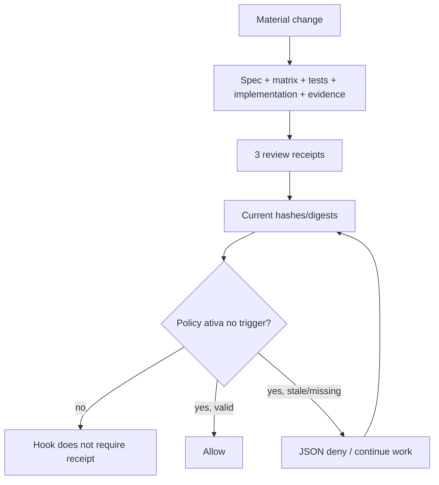

# 05 — Hooks, Rules, templates, and tests

## Enforcement overview

`hooks/hooks.json:1-30` registers `PreToolUse` for Bash and `Stop`, both launching `guard.py` through `uv run python`. The guard does not try to classify every shell command: it recognizes a direct `git commit` in PreToolUse (`guard.py:367-383`) and validates receipts when policy includes `commit`/`stop`. Native Rules cover some external/destructive commands. This conceptual separation is correct and well explained in `docs/architecture/enforcement.md`.

## What the guard actually proves

Confirmed strengths:

- `resolve_inside` rejects absolute paths and artifacts that resolve outside the project (`guard.py:68-76`).
- SHA-256 uses bytes and a strict format (`guard.py:79-98`).
- Digests use canonical JSON with sorted keys.
- Trees are compared exactly; an omitted or extra file blocks (`guard.py:141-162`).
- Fail-first/passing, documentation, and downstream reviews have chained hashes/digests.
- A handled `GuardError` produces compatible deny JSON without attempting to resolve semantic judgments.

Confirmed limits:

- hashes represent the working tree at read time, not the Git index;
- hashes prove integrity, not semantic adequacy or actual independence;
- one global test pair does not prove coverage by AC;
- globs/defaults can make policy impossible;
- unhandled filesystem errors leave the protocol;
- the UV launcher acts before any guard opt-in.

## Controlled probes

All used `TemporaryDirectory`/`mktemp` outside the checkout and none was destructive.

| Probe | Observed result | Finding |
| --- | --- | --- |
| Actual hook definition in a project with valid `pyproject.toml` and no policy | Exit 0; created `.venv` and `uv.lock` | `TUX-AUD-002` |
| Same probe with invalid `pyproject.toml` | UV exit 2 before `guard.py` | `TUX-AUD-002` |
| Working tree `VALUE=1`, staged index `VALUE=999` | PreToolUse commit and Stop passed | `TUX-AUD-003` |
| Broken `.tuxedo/policy.json` symlink | Exit 0, gate inactive | `TUX-AUD-004` |
| Policy symlink outside the project | External file read | `TUX-AUD-004` |
| Policy path as directory | `IsADirectoryError`, exit 1, no deny JSON | `TUX-AUD-004` |
| Receipt with no AC, trivial `assert True` test | Passed | `TUX-AUD-010` |
| `src/example.test.ts` with defaults | Selected as both test and implementation; blocked by overlap | `TUX-AUD-019` |
| spec/matrix/evidence pointing to the same path | Passed after rehash | `TUX-AUD-017` |
| test review `tests_exposed=false`; code review `{}` | Passed | `TUX-AUD-018` |
| Rules wrappers/options | Several forms returned decision `null` | `TUX-AUD-020` |

### UV launcher

Local fact: `hooks/hooks.json:10-11,22-23` runs `uv run python` with a 10 s timeout. External fact: UV documentation says `uv run` ensures the project environment in the cwd is up to date; Codex documentation says hooks execute in the session cwd. The test helper (`tests/test_toolkit.py:235-238`) replaces cwd only in the JSON payload, but does not pass `cwd=` to the subprocess. Therefore, green tests do not simulate the real runtime.

Concrete impact: even a Bash command without policy can modify the consumer, synchronize dependencies, access indexes/builds, and consume the timeout. In `PreToolUse`, exit 2 blocks; in `Stop`, semantics differ, creating asymmetric behavior. `commandWindows` is also missing. See `TUX-AUD-002`.

### Candidate commit binding

`guard.py:79-98,141-162,247-364` reads files/globs from the filesystem; it does not execute `git diff --cached`, `git show :path`, or build an index snapshot. `skills/git-commit/SKILL.md:8-12` refers to a staged diff and verified commit. The name “commit gate” creates a specific expectation that the mechanism does not satisfy. Shell substitutions and `git commit -a` add TOCTOU. See `TUX-AUD-003`.

### Fail-closed policy

`guard.py:247-251` uses `Path.exists()`; a broken symlink looks absent. `load_object` does not catch every `OSError`. The documentation says malformed entries fail closed, but exit 1/traceback is hook failure, not a protocolized deny. The boundary needs `lstat`, a regular-file check, an explicit symlink policy, containment, and uniform error conversion. See `TUX-AUD-004`.

## Receipts and templates

### Format mapping

| Artifact | Template | Actual validation | Gap |
| --- | --- | --- | --- |
| Spec | `templates/spec/spec.md` | Path + hash | No schema/AC binding in the receipt. |
| Matrix | `templates/spec/behavior-matrix.md` | Path + hash | May be the same file as the spec. |
| Evidence | `templates/spec/evidence.md` | Path + hash | AC lines are not validated. |
| Test evidence | `templates/policy/receipts.json` | One global fail-first + one passing | No cardinality by criterion. |
| Spec review | `templates/review/spec.json` | Strict false/false | Good shape for context; does not prove isolation. |
| Test review | `templates/review/tests.json` | only implementation=false | Opposite/absent `tests_exposed` passes. |
| Code review | `templates/review/code.json` | hashes/digests, no context | Official booleans may be missing. |

The seven root/skill template pairs were byte-identical, avoiding drift in the snapshot. There is no canonical source or generation contract (`TUX-AUD-028`). The default policy simultaneously includes `**/*.test.*` and `src/**/*` with overlap prohibited (`templates/policy/policy.json:8-16`), which is incompatible with co-located tests (`TUX-AUD-019`).

### Normal, blocked, and authorized

The blocked flow is legitimate while progress remains possible. But impossible policy, broken runtime, or a persistently stale receipt can form a Stop loop; `guard.py:387-391` does not use `stop_hook_active`. This is residual risk, not an isolated finding without proof of infinite repetition in the client.

## Rules

`templates/codex/tuxedo.rules` is a useful approval template for common commands. The test uses the official `codex execpolicy check` mechanism, so this family is `external`, not a reimplementation. The detailed documentation recognizes prefix matching and bypasses.

The public summary is still too broad. Probes returned `null` for:

- `/usr/bin/git push`, `env git push`, `git -C . push`;
- `rm -rf -- /`, `rm -rfv /`;
- `git clean -fdx`;
- `git rebase -i`, `git tag -d`.

Rules should not become an artisanal shell parser. The fix is to align claims, expand only mechanically reliable prefixes, and document deliberately uncovered forms (`TUX-AUD-020`).

## Deterministic tests

### Result

`PYTHONDONTWRITEBYTECODE=1 uv run python -m unittest discover -s tests -v` ran 65 tests and passed in 2.121 s. Tests use temporary directories and are fast. AST checks for the 13 Python scripts passed. No shell script is tracked.

### Contract → test map

| Contract | Current test | Provenance | Gap |
| --- | --- | --- | --- |
| Valid manifest/skills | validators + structure tests | `external` + `implementation-aware` | Does not prove a cross-platform client. |
| Valid/missing/malformed hook protocol | `tests/test_toolkit.py:384-394` | `spec-derived` | OSError, symlink, FIFO, real cwd. |
| Hook does not classify arbitrary commands | `:395-407` | `spec-derived` | Substitution/compound commands and commit forms. |
| Commit/Stop require receipts | `:409-424` | `spec-derived` | Git index and `commit -a`. |
| Stale hashes/reviews/docs | `:425-461` | mixed | Aliases, test/code context, races. |
| Exact scope | `:463-484` | `spec-derived` | Default overlap, symlinks, co-located layout. |
| Docs not required | `:486-500` | `spec-derived` | Adversarial artifacts/aliases. |
| Native Rules | `:214-232` | `external` | Incomplete protected matrix. |
| Synchronized templates | `:128-141` | `implementation-aware` | Missing canonical source. |

### Shared-error risk

Helpers `write_receipt`, `digest_object`, and `digest_map` (`tests/test_toolkit.py:64-75,264-381`) replicate the guard's format/algorithm. They are useful for fixture construction, but may reproduce the same error. There is no versioned independent oracle for “candidate commit,” AC IDs, or phase context. This audit's probes are `diagnostic-probe`; they do not replace repository regression tests.

### Recommended mutation matrix

1. index different from the working tree; deletion, rename, intent-to-add, and `commit -a`;
2. internal/external/broken policy symlink, directory, FIFO, unreadable path, and removal race;
3. artifacts with path alias, symlink, and hardlink;
4. missing, duplicate, unknown, and no-fail/pass AC;
5. missing/extra context key, wrong type, and contrary value by phase;
6. valid/invalid UV repo in cwd and Windows launcher;
7. separate Python layout, co-located JS, and monorepo;
8. global wrappers/options for each Rules claim;
9. large tree for timeout and glob cost.

## Residual risks

- TOCTOU exists between hash reads and command execution.
- `approved` reviews with non-empty findings pass; resolution is not represented.
- The guard reads files in full and has no scale test for the 10 s timeout.
- No real Codex/Windows/race session took place in this audit.
- A hook can enforce declared integrity; it cannot prove architecture, semantics, or human independence, as the documentation itself recognizes.
