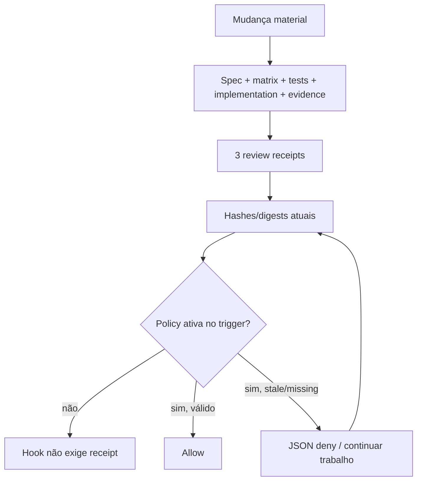

# 05 — Hooks, Rules, templates e testes

## Visão geral do enforcement

`hooks/hooks.json:1-30` registra `PreToolUse` para Bash e `Stop`, ambos lançando `guard.py` por `uv run python`. O guard não tenta classificar todo shell: ele reconhece `git commit` direto em PreToolUse (`guard.py:367-383`) e valida receipts quando a policy inclui `commit`/`stop`. Rules nativas cobrem alguns comandos externos/destrutivos. Essa separação conceitual é correta e está bem explicada em `docs/architecture/enforcement.md`.

## O que o guard realmente prova

Pontos fortes confirmados:

- `resolve_inside` rejeita path absoluto e artifact que resolva fora do projeto (`guard.py:68-76`).
- SHA-256 usa bytes e formato estrito (`guard.py:79-98`).
- Digests usam JSON canônico com chaves ordenadas.
- Trees são comparados exatamente; arquivo omitido ou extra bloqueia (`guard.py:141-162`).
- Fail-first/passing, documentação e reviews downstream têm hashes/digests encadeados.
- `GuardError` tratado produz JSON deny compatível, sem tentar resolver julgamentos semânticos.

Limites confirmados:

- hashes representam a working tree no instante da leitura, não o índice Git;
- hashes provam integridade, não adequação semântica ou independência real;
- um par global de testes não prova cobertura por AC;
- globs/defaults podem tornar a policy impossível;
- filesystem errors não tratados saem do protocolo;
- o launcher UV atua antes de qualquer opt-in do guard.

## Probes controlados

Todos usaram `TemporaryDirectory`/`mktemp` fora do checkout e nenhum foi destrutivo.

| Probe | Resultado observado | Finding |
| --- | --- | --- |
| Definição real do hook em projeto com `pyproject.toml` válido e sem policy | Exit 0; criou `.venv` e `uv.lock` | `TUX-AUD-002` |
| Mesmo probe com `pyproject.toml` inválido | UV exit 2 antes de `guard.py` | `TUX-AUD-002` |
| Working tree `VALUE=1`, índice staged `VALUE=999` | PreToolUse commit e Stop passaram | `TUX-AUD-003` |
| `.tuxedo/policy.json` symlink quebrado | Exit 0, gate inativo | `TUX-AUD-004` |
| Policy symlink para fora | Arquivo externo lido | `TUX-AUD-004` |
| Policy path como diretório | `IsADirectoryError`, exit 1, sem deny JSON | `TUX-AUD-004` |
| Receipt sem nenhum AC, teste trivial `assert True` | Passou | `TUX-AUD-010` |
| `src/example.test.ts` com defaults | Selecionado como test e implementation; bloqueio por overlap | `TUX-AUD-019` |
| spec/matrix/evidence apontando para o mesmo path | Passou após rehash | `TUX-AUD-017` |
| test review `tests_exposed=false`; code review `{}` | Passou | `TUX-AUD-018` |
| Wrappers/options de Rules | Várias formas retornaram decision `null` | `TUX-AUD-020` |

### Launcher UV

Fato local: `hooks/hooks.json:10-11,22-23` executa `uv run python` com timeout 10 s. Fato externo: a documentação UV afirma que `uv run` garante que o project environment no cwd esteja atualizado; a documentação Codex afirma que hooks executam no cwd da sessão. O helper de teste (`tests/test_toolkit.py:235-238`) substitui o cwd apenas no payload JSON, mas não passa `cwd=` ao subprocesso. Por isso os testes verdes não simulam o runtime real.

Impacto concreto: até um Bash sem policy pode modificar o consumidor, sincronizar dependências, acessar índices/builds e gastar o timeout. Em `PreToolUse`, exit 2 bloqueia; em `Stop`, a semântica difere, criando comportamento assimétrico. Falta também `commandWindows`. Ver `TUX-AUD-002`.

### Binding ao commit candidate

`guard.py:79-98,141-162,247-364` lê files/globs do filesystem; não executa `git diff --cached`, `git show :path` nem constrói snapshot do índice. `skills/git-commit/SKILL.md:8-12` fala em staged diff e commit verificado. O nome “commit gate” cria uma expectativa específica que o mecanismo não satisfaz. Substituições shell e `git commit -a` adicionam TOCTOU. Ver `TUX-AUD-003`.

### Policy fail-closed

`guard.py:247-251` usa `Path.exists()`; symlink quebrado parece ausência. `load_object` não captura todo `OSError`. A documentação afirma que entradas malformadas falham fechadas, mas exit 1/traceback é hook failure, não um deny protocolado. O boundary precisa de `lstat`, arquivo regular, política explícita para symlink, contenção e conversão uniforme de erro. Ver `TUX-AUD-004`.

## Receipts e templates

### Mapeamento do formato

| Artefato | Template | Validação real | Gap |
| --- | --- | --- | --- |
| Spec | `templates/spec/spec.md` | Path + hash | Sem schema/AC binding no receipt. |
| Matrix | `templates/spec/behavior-matrix.md` | Path + hash | Pode ser o mesmo arquivo da spec. |
| Evidence | `templates/spec/evidence.md` | Path + hash | Linhas AC não validadas. |
| Test evidence | `templates/policy/receipts.json` | Um fail-first + um passing global | Sem cardinalidade por critério. |
| Spec review | `templates/review/spec.json` | false/false estrito | Bom shape para contexto; não prova isolamento. |
| Test review | `templates/review/tests.json` | somente implementation=false | `tests_exposed` contrário/ausente passa. |
| Code review | `templates/review/code.json` | hashes/digests, sem contexto | Booleans oficiais podem faltar. |

Os sete pares de templates root/skill estavam byte-identical, o que evita drift no snapshot. Não há fonte canônica ou generation contract (`TUX-AUD-028`). A policy default inclui simultaneamente `**/*.test.*` e `src/**/*` com overlap proibido (`templates/policy/policy.json:8-16`), incompatível com testes co-localizados (`TUX-AUD-019`).

### Normal, bloqueado e autorizado

O fluxo bloqueado é legítimo enquanto houver progresso possível. Mas policy impossível, runtime quebrado ou receipt persistentemente stale pode formar loop de Stop; `guard.py:387-391` não usa `stop_hook_active`. Isso é risco residual, não finding isolado sem prova de repetição infinita no cliente.

## Rules

`templates/codex/tuxedo.rules` é um template útil de aprovação para comandos comuns. O teste usa o mecanismo oficial `codex execpolicy check`, portanto essa família é `external`, não uma reimplementação. A documentação profunda reconhece prefix matching e bypasses.

O resumo público ainda é amplo demais. Os probes retornaram `null` para:

- `/usr/bin/git push`, `env git push`, `git -C . push`;
- `rm -rf -- /`, `rm -rfv /`;
- `git clean -fdx`;
- `git rebase -i`, `git tag -d`.

Rules não devem virar parser shell artesanal. A correção é alinhar claims, ampliar apenas prefixos mecanicamente confiáveis e documentar formas deliberadamente não cobertas (`TUX-AUD-020`).

## Testes determinísticos

### Resultado

`PYTHONDONTWRITEBYTECODE=1 uv run python -m unittest discover -s tests -v` executou 65 testes e passou em 2,121 s. Testes usam temporários e são rápidos. AST dos 13 scripts Python passou. Não há shell script rastreado.

### Mapa contrato → testes

| Contrato | Teste atual | Proveniência | Lacuna |
| --- | --- | --- | --- |
| Manifest/skills válidos | validators + tests de estrutura | `external` + `implementation-aware` | Não prova cliente cross-platform. |
| Protocolo hook válido/missing/malformed | `tests/test_toolkit.py:384-394` | `spec-derived` | OSError, symlink, FIFO, cwd real. |
| Hook não classifica comandos arbitrários | `:395-407` | `spec-derived` | Substitution/compound e forms do commit. |
| Commit/Stop exigem receipts | `:409-424` | `spec-derived` | Índice Git e `commit -a`. |
| Hashes/reviews/docs stale | `:425-461` | misto | Aliases, context test/code, races. |
| Scope exato | `:463-484` | `spec-derived` | Overlap default, symlinks, layout co-localizado. |
| Docs not-required | `:486-500` | `spec-derived` | Adversarial artifacts/aliases. |
| Rules nativas | `:214-232` | `external` | Matriz protegida incompleta. |
| Templates sincronizados | `:128-141` | `implementation-aware` | Fonte canônica ausente. |

### Shared-error risk

Helpers `write_receipt`, `digest_object` e `digest_map` (`tests/test_toolkit.py:64-75,264-381`) replicam o formato/algoritmo do guard. Eles são úteis para fixture construction, mas podem reproduzir o mesmo erro. Não há oracle independente versionado para “candidate commit”, IDs AC ou contexto das fases. Os probes desta auditoria são `diagnostic-probe`, não substituem testes regressivos no repositório.

### Mutation matrix recomendada

1. index diferente da working tree; deletion, rename, intent-to-add e `commit -a`;
2. policy symlink interno/externo/quebrado, directory, FIFO, unreadable e race de remoção;
3. artifacts com path alias, symlink e hardlink;
4. AC ausente, duplicado, desconhecido e sem fail/pass;
5. context key ausente/extra/tipo errado/valor contrário por fase;
6. repo UV válido/inválido no cwd e Windows launcher;
7. layout Python separado, JS co-localizado e monorepo;
8. wrappers/opções globais de cada claim de Rules;
9. tree grande para timeout e custo de globs.

## Riscos residuais

- TOCTOU existe entre leituras de hashes e execução do comando.
- Reviews `approved` com findings não vazios passam; resolução não está representada.
- O guard lê files integralmente e não tem teste de escala para timeout de 10 s.
- Não houve sessão Codex real/Windows/race real nesta auditoria.
- Um hook pode reforçar integridade declarada; não pode provar arquitetura, semântica ou independência humana, como a própria documentação reconhece.
