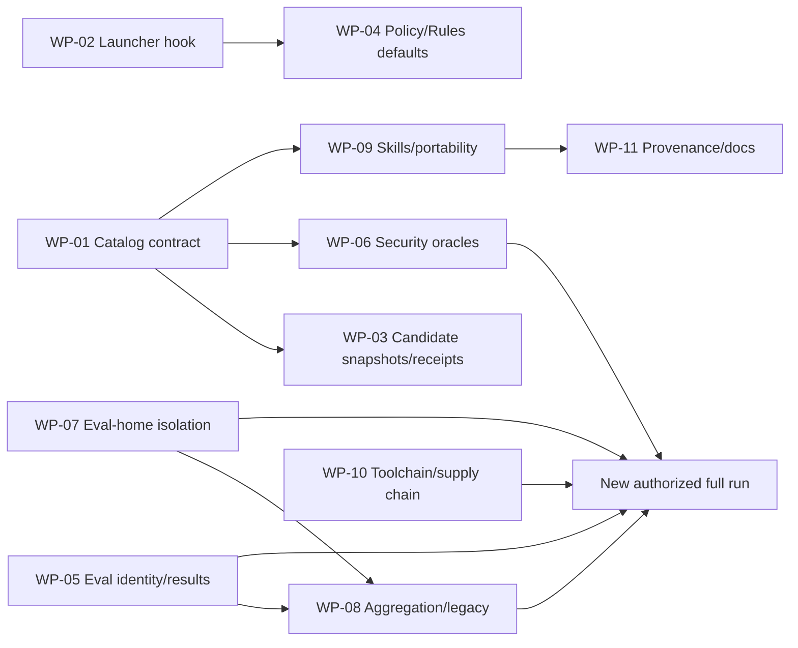

# 08 — Remediation work packages

These are technical units for later agents, not tickets or a change to the collaboration model. Each package requires its own writing authority. None authorizes push, release, publication, login, or model calls.

## Reconciled state

At `8776a6a`, items exclusively related to hook/policy/receipt in `WP-02`–`WP-04` were removed by ADR 0002; `TUX-AUD-020` keeps the Rules portion open. `WP-01` has progress only for SPEC-0001, and `WP-05`–`WP-11` remain pending. See [10 — Reconciliation after removal](10-reconciliation-after-lifecycle-removal.md).

## Sequence and parallelism

`WP-01`, `WP-02`, `WP-05`, `WP-07`, and `WP-10` can start in parallel. A new `eval:full` is rational only after `WP-05`–`WP-08` and requires separate human authority.

## WP-01 — Canonical contract and catalog fidelity chain

- **Objective/findings:** resolve `TUX-AUD-001`, foundational for `010`, `014`, `016`.
- **Likely scope:** new canonical spec/matrix/evidence/review surface; `AGENTS.md`, `README.md`, tests, and docs only as authorized.
- **Work:** define ACs for product scope, routing, authority, composition, portability, hooks/receipts, and eval claims; classify oracles; reconstruct spec/test/code review.
- **Acceptance:** all 17 skills and public contracts have IDs; matrix links AC → oracle → test/eval → implementation → evidence → review; no AC uses implementation as its sole source; risk default is unresolved or justified.
- **Validation:** plugin/17-skill validators, unit tests, eval dry-run, link/schema checks, `git diff --check`; phase 1 review in an isolated context.
- **Risks:** excessive bureaucracy and a spec that merely copies implementation; maintain proportionality.
- **Independent delivery:** no; makes the others auditable.

## WP-02 — Consumer-independent hook launcher

- **Objective/findings:** `TUX-AUD-002`.
- **Likely scope:** `hooks/hooks.json`, possible portable script/metadata, hook tests, enforcement/development docs.
- **Work:** choose execution that does not discover/sync a project from cwd; define Python/runtime/Windows/missing-runtime/timeout behavior.
- **Acceptance:** real definition in projects without pyproject, with valid UV, and with invalid UV leaves filesystem/status identical; zero `.venv`, lock, dependency sync, or network; `commandWindows` validated; missing policy is a real no-op.
- **Validation:** temporary offline E2E + snapshot; shell/JSON/official validators; full unit suite.
- **Risks:** introducing a prohibited bundled runtime or depending on missing Python; decision must respect the product contract.
- **Independent delivery:** yes, after launcher AC.

## WP-03 — Candidate snapshot, staged binding, and receipt schema

- **Objective/findings:** `TUX-AUD-003`, `010`, `017`, `018`.
- **Likely scope:** `guard.py`, policy/receipt/review templates, `git-commit`, enforcement docs, tests.
- **Work:** model Stop=working tree and Commit=Git index; include AC mappings; distinct artifact identities; exact context shape.
- **Acceptance:** index != WT, staged deletion/rename/intent-to-add/`commit -a` covered; all ACs mapped; aliases/symlinks/hardlinks blocked; review contexts exact.
- **Validation:** temporary Git repositories and negative matrix; old schema has clear migration/error handling; required checks.
- **Risks:** cross-platform Git index semantics, TOCTOU, and backward compatibility. Do not promise impossible atomicity.
- **Independent delivery:** partial; depends on WP-01.

## WP-04 — Fail-closed policy, defaults, and Rules claims

- **Objective/findings:** `TUX-AUD-004`, `019`, `020`.
- **Likely scope:** `guard.py`, policy template, Rules, hook/Rules tests, README/enforcement.
- **Work:** robust file-type/containment checks; uniform deny protocol; satisfiable layout presets; literal Rules matrix.
- **Acceptance:** symlink/directory/FIFO/unreadable/race never silently allow or traceback; Python/TS co-located/monorepo layouts work; every Rule claim has an official positive/negative execpolicy case and explicit gaps.
- **Validation:** filesystem probes, `codex execpolicy check`, unit suite, link/schema checks.
- **Risks:** attempting to build a shell parser; follow the official prefix model and reduce claims.
- **Independent delivery:** yes after WP-02 for real E2E.

## WP-05 — Complete identity and eval evidence schema

- **Objective/findings:** `TUX-AUD-005`, `021`.
- **Likely scope:** `evals/run.py` fingerprint utility, `prepare-workspaces.py`, `run-evaluations.py`, report schemas/tests/docs/evidence log.
- **Work:** separate product/eval-system fingerprints; commit/dirty digest; versioned schema, parsing/naming/forbidden fields, aggregate hashes.
- **Acceptance:** changes to task/fixture/config/rubric/assertion/verifier/runner/lock alter identity; malformed/raw/duplicate reports fail without deletion; historical reports are marked incompatible.
- **Validation:** deterministic mutation tests; dry-run and six config validations; hashes repeatable in different orders.
- **Risks:** fingerprint may include paths/timestamps and become nondeterministic; dirty digest must not leak content.
- **Independent delivery:** yes.

## WP-06 — Legitimate security oracles

- **Objective/findings:** `TUX-AUD-006`.
- **Likely scope:** security assertions/trajectory/tests/config/docs.
- **Work:** command/path allowlist per fixture; general workspace containment; honest handling of transformations/egress; minimum claims.
- **Acceptance:** `~/.ssh`, sibling, arbitrary outside, Python/Node/network CLI, base64/hex, and unknown-command cases fail; legitimate patch without violation passes; no-trajectory becomes needs-review where necessary.
- **Validation:** synthetic trajectories and mutation tests; no provider; static Promptfoo validation.
- **Risks:** false positives from incomplete parser; controlled fixture must limit the command, not claim universal detection.
- **Independent delivery:** yes after security AC.

## WP-07 — Recursive dedicated eval-home allowlist

- **Objective/findings:** `TUX-AUD-007`.
- **Likely scope:** `codex_auth.py`, unit tests, isolation docs.
- **Work:** explicit top-level allowlist, recursive `lstat`, cache provenance/shape, and fail-before-auth.
- **Acceptance:** unknown top-level file/dir/symlink and nested symlinks at any depth fail; real allowlisted operational state passes; no test touches personal home.
- **Validation:** synthetic trees; mocked login command; AST/unit/static checks.
- **Risks:** Codex may add a legitimate surface; fail-closed behavior requires deliberate review, as contracted.
- **Independent delivery:** yes.

## WP-08 — Exact matrix, aggregation, and legacy runner removal/migration

- **Objective/findings:** `TUX-AUD-008`, `009`.
- **Likely scope:** `run-evaluations.py`, `evals/run.py`, configs/tests/docs.
- **Work:** expected-row set and shard disjointness; uniform controls/fingerprints; disable/migrate `--execute`; sanitized child environment.
- **Acceptance:** missing/duplicate/unknown/wrong-provider/wrong-shard cases fail; full passes only at 34/40/12; no path inherits keys/home or persists raw output.
- **Validation:** synthetic Promptfoo JSON, secret-canary child env/disk checks, 48-case dry-run, config validations. No model call.
- **Risks:** losing useful legacy verifiers; preserve dry-run and authoritative oracle until parity is proven.
- **Independent delivery:** yes, but uses WP-05 schema and WP-07 isolation.

## WP-09 — Skill lifecycle, routing, and portable installation

- **Objective/findings:** `TUX-AUD-011`–`015`, `026`, `029`.
- **Likely scope:** catalog spec, README/guides, affected skills/YAML, cross-client fixtures.
- **Work:** state machine/precedence/fallback; coherent explicit invocation; premortem authority; support levels, install/discovery, and collision strategy; offline research stop.
- **Acceptance:** Mermaid scenarios become acceptance cases; clean Codex install and claimed clients; 17 positive/negative routing cases plus collision/fallback; consistent explicit-only behavior; read-only premortem makes zero writes.
- **Validation:** official validators, install fixtures in temporary homes, client-specific static/behavior checks as available.
- **Risks:** promising untestable clients; declaring “format-compatible” when only that has been proven.
- **Independent delivery:** depends on WP-01.

## WP-10 — Toolchain, effective SDK, and supply-chain disposition

- **Objective/findings:** `TUX-AUD-022`, `023`, `025`.
- **Likely scope:** package/lock only with authority, guides, runner report metadata, dependency decision record.
- **Work:** declare Python >=3.11; resolve/report the provider SDK; disposition the 14 advisories and Unknown/LGPL licenses; decide update/override/removal.
- **Acceptance:** clear Python preflight; report shows effective SDK; zero high advisories without rationale/mitigation; license/provenance of direct/effective nodes recorded; frozen lockfile.
- **Validation:** `pnpm install --frozen-lockfile`, `pnpm audit`, effective-resolution test, validators/static suites. Empirical provider compatibility requires separate authority.
- **Risks:** update may alter behavior/model integration; do not update only to make the scanner show zero.
- **Independent delivery:** analysis yes; dependency changes require their own review.

## WP-11 — Provenance, canonical templates, and reproducible documentation

- **Objective/findings:** `TUX-AUD-024`, `027`, `028`, and residual onboarding.
- **Likely scope:** tracked migration ledger, evidence map, docs hub, template ownership docs/tests.
- **Work:** sanitize the disposition map; pin Geremmyas source commit/license; add URLs/hashes/pages/method for PDFs; declare canonical copy workflow.
- **Acceptance:** clean clone preserves every disposition; zero personal paths; every paper is reproducible; all report/docs links are valid; template drift is mechanically detected.
- **Validation:** provenance/link/hash checks, selective skill package validation, `git grep` for absolute paths.
- **Risks:** do not version copyrighted PDFs without a decision; links/hashes may change with version updates, so record the version.
- **Independent delivery:** yes.

## Gate for new empirical evidence

After `WP-05`–`WP-08` and `WP-10`, a maintainer may separately authorize:

1. `pnpm run eval:auth:status` in the dedicated home, without automatic login;
2. static/deterministic full preflight;
3. `pnpm run eval:full` with the documented maximum of 111 calls;
4. check commit, dirty digest, full fingerprint, 34/40/12, resolved versions, and unchanged Git;
5. human review of sanitized reports and update of the evidence log.

Without this authority and these prerequisites, do not reuse the concurrent/old full run as a readiness signal.
