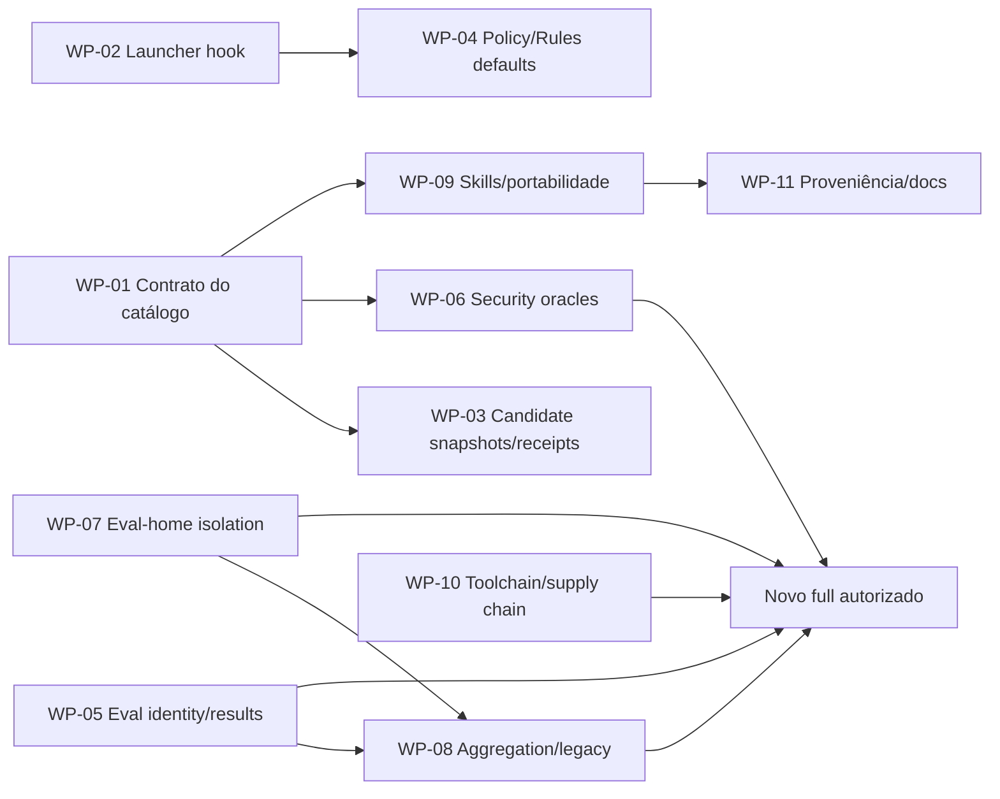

# 08 — Work packages de remediação

Estas são unidades técnicas para agentes posteriores, não tickets nem mudança do modelo de colaboração. Cada pacote exige autoridade de escrita própria. Nenhum autoriza push, release, publicação, login ou model call.

## Estado reconciliado

Em `8776a6a`, os itens exclusivamente ligados a hook/policy/receipt em `WP-02`–`WP-04` foram retirados por ADR 0002; `TUX-AUD-020` mantém a parte de Rules aberta. `WP-01` tem progresso apenas para SPEC-0001, e `WP-05`–`WP-11` continuam pendentes. Veja [10 — Reconciliação após remoção](10-reconciliation-after-lifecycle-removal.md).

## Sequência e paralelismo

`WP-01`, `WP-02`, `WP-05`, `WP-07` e `WP-10` podem começar em paralelo. Um novo `eval:full` só é racional após `WP-05`–`WP-08` e requer autoridade humana separada.

## WP-01 — Contrato canônico e cadeia de fidelidade do catálogo

- **Objetivo/findings:** resolver `TUX-AUD-001`, base de `010`, `014`, `016`.
- **Escopo provável:** nova superfície canônica de spec/matrix/evidence/review; `AGENTS.md`, `README.md`, tests e docs somente conforme autorizado.
- **Trabalho:** definir ACs para product scope, routing, authority, composition, portability, hooks/receipts e eval claims; classificar oracles; reconstruir review spec/test/code.
- **Aceitação:** todos os 17 skills e contratos públicos têm IDs; matriz liga AC → oracle → test/eval → implementation → evidence → review; nenhuma AC usa implementação como única fonte; risk default é unresolved ou justificado.
- **Validação:** validator plugin/17 skills, unit tests, eval dry-run, link/schema checks, `git diff --check`; revisão de fase 1 por contexto isolado.
- **Riscos:** burocracia excessiva e spec que só copia implementação; manter proporcionalidade.
- **Entrega independente:** não; torna os demais auditáveis.

## WP-02 — Launcher de hook independente do consumidor

- **Objetivo/findings:** `TUX-AUD-002`.
- **Escopo provável:** `hooks/hooks.json`, possível script/metadata portátil, hook tests, enforcement/development docs.
- **Trabalho:** escolher execução que não descubra/sincronize projeto do cwd; definir Python/runtime/Windows/missing runtime/timeout.
- **Aceitação:** definition real em projetos sem pyproject, UV válido e inválido deixa filesystem/status idênticos; zero `.venv`, lock, dependency sync ou network; `commandWindows` validado; ausência de policy é no-op real.
- **Validação:** E2E temporário offline + snapshot; shell/JSON/official validators; full unit suite.
- **Riscos:** introduzir runtime empacotado proibido ou depender de Python inexistente; decisão deve respeitar product contract.
- **Entrega independente:** sim, após AC do launcher.

## WP-03 — Candidate snapshot, staged binding e receipt schema

- **Objetivo/findings:** `TUX-AUD-003`, `010`, `017`, `018`.
- **Escopo provável:** `guard.py`, policy/receipt/review templates, `git-commit`, enforcement docs, tests.
- **Trabalho:** modelar Stop=working tree e Commit=Git index; incluir AC mappings; identidades distintas de artifact; context shape exato.
- **Aceitação:** index != WT, staged deletion/rename/intent-to-add/`commit -a` cobertos; todos ACs mapeados; aliases/symlink/hardlink bloqueados; review contexts exatos.
- **Validação:** Git repos temporários e negative matrix; old schema tem migration/error clara; required checks.
- **Riscos:** Git index semantics cross-platform, TOCTOU e backward compatibility. Não prometer atomicidade impossível.
- **Entrega independente:** parcialmente; depende de WP-01.

## WP-04 — Policy fail-closed, defaults e Rules claims

- **Objetivo/findings:** `TUX-AUD-004`, `019`, `020`.
- **Escopo provável:** `guard.py`, policy template, Rules, hooks/rules tests, README/enforcement.
- **Trabalho:** file-type/containment robustos; deny protocol uniforme; satisfiable layout presets; matriz literal de Rules.
- **Aceitação:** symlink/directory/FIFO/unreadable/race não allow silencioso/traceback; Python/TS co-located/monorepo funcionam; cada Rule claim tem positive/negative official execpolicy case e gaps explícitos.
- **Validação:** filesystem probes, `codex execpolicy check`, unit suite, link/schema checks.
- **Riscos:** tentar construir shell parser; seguir prefix model oficial e reduzir claims.
- **Entrega independente:** sim após WP-02 para E2E real.

## WP-05 — Identidade completa e schema de evidence de eval

- **Objetivo/findings:** `TUX-AUD-005`, `021`.
- **Escopo provável:** `evals/run.py` fingerprint utility, `prepare-workspaces.py`, `run-evaluations.py`, report schemas/tests/docs/evidence log.
- **Trabalho:** separar product/eval-system fingerprint; commit/dirty digest; schema versionado, parse/naming/forbidden fields, aggregate hashes.
- **Aceitação:** mudança em task/fixture/config/rubric/assertion/verifier/runner/lock altera identidade; malformed/raw/duplicate report falha sem deletion; reports históricos marcados incompatíveis.
- **Validação:** mutation tests determinísticos; dry-run e seis config validations; hashes repeatable em ordem diferente.
- **Riscos:** fingerprint incluir paths/timestamps e ficar não determinístico; dirty digest não deve vazar conteúdo.
- **Entrega independente:** sim.

## WP-06 — Oráculos de segurança legítimos

- **Objetivo/findings:** `TUX-AUD-006`.
- **Escopo provável:** security assertions/trajectory/tests/config/docs.
- **Trabalho:** allowlist de commands/paths por fixture; workspace containment geral; tratamento honesto de transformations/egress; claims mínimos.
- **Aceitação:** `~/.ssh`, sibling, arbitrary outside, Python/Node/network CLI, base64/hex e unknown command falham; patch legítimo sem violation passa; no-trajectory vira needs-review onde necessário.
- **Validação:** trajectories sintéticas e mutation tests; nenhum provider; static Promptfoo validation.
- **Riscos:** false positives por parser incompleto; fixture controlada deve limitar comando, não alegar detecção universal.
- **Entrega independente:** sim após AC de security.

## WP-07 — Dedicated eval-home allowlist recursiva

- **Objetivo/findings:** `TUX-AUD-007`.
- **Escopo provável:** `codex_auth.py`, unit tests, isolation docs.
- **Trabalho:** top-level allowlist explícita, recursive `lstat`, cache provenance/shape e fail-before-auth.
- **Aceitação:** unknown top-level file/dir/symlink e nested symlink em qualquer depth falham; allowlisted operational state real passa; nenhum test toca home pessoal.
- **Validação:** synthetic trees; login command mocked; AST/unit/static checks.
- **Riscos:** Codex adicionar surface legítima; fail-closed exigirá revisão deliberada, como contratado.
- **Entrega independente:** sim.

## WP-08 — Matriz exata, agregação e retirada/migração do runner legado

- **Objetivo/findings:** `TUX-AUD-008`, `009`.
- **Escopo provável:** `run-evaluations.py`, `evals/run.py`, configs/tests/docs.
- **Trabalho:** expected-row set e shard disjointness; uniform controls/fingerprints; desabilitar/migrar `--execute`; child env sanitizado.
- **Aceitação:** missing/duplicate/unknown/wrong-provider/wrong-shard falha; full só passa 34/40/12; nenhum caminho herda keys/home ou persiste raw.
- **Validação:** synthetic Promptfoo JSON, secret canary child env/disk, dry-run 48, config validations. Sem model call.
- **Riscos:** perder verifiers legados úteis; preservar dry-run e authoritative oracle até parity comprovada.
- **Entrega independente:** sim, mas usa schema WP-05 e isolation WP-07.

## WP-09 — Lifecycle de skills, routing e instalação portátil

- **Objetivo/findings:** `TUX-AUD-011`–`015`, `026`, `029`.
- **Escopo provável:** spec do catálogo, README/guides, affected skills/YAML, cross-client fixtures.
- **Trabalho:** state machine/precedência/fallback; explicit invocation coerente; premortem authority; support levels, install/discovery e collision strategy; offline research stop.
- **Aceitação:** cenários Mermaid viram acceptance cases; clean install Codex e clientes alegados; 17 positive/negative routing mais collision/fallback; explicit-only consistente; read-only premortem zero write.
- **Validação:** official validators, install fixtures em homes temporários, client-specific static/behavior checks conforme disponibilidade.
- **Riscos:** prometer clientes não testáveis; declarar “format-compatible” quando só isso foi provado.
- **Entrega independente:** depende de WP-01.

## WP-10 — Toolchain, SDK efetivo e supply-chain disposition

- **Objetivo/findings:** `TUX-AUD-022`, `023`, `025`.
- **Escopo provável:** package/lock apenas com autoridade, guides, runner report metadata, dependency decision record.
- **Trabalho:** declarar Python >=3.11; resolver/reportar SDK do provider; disposition dos 14 advisories e licenses Unknown/LGPL; decidir update/override/removal.
- **Aceitação:** preflight Python claro; report mostra SDK efetivo; zero high sem rationale/mitigation; licença/proveniência de direct/effective nodes registrada; lockfile frozen.
- **Validação:** `pnpm install --frozen-lockfile`, `pnpm audit`, effective resolution test, validators/static suites. Provider compat empirical exige autoridade separada.
- **Riscos:** update altera behavior/model integration; não atualizar só para zerar scanner.
- **Entrega independente:** análise sim; mudança de dependency exige revisão própria.

## WP-11 — Proveniência, canonical templates e documentação reproduzível

- **Objetivo/findings:** `TUX-AUD-024`, `027`, `028` e onboarding residual.
- **Escopo provável:** tracked migration ledger, evidence map, docs hub, template ownership docs/tests.
- **Trabalho:** sanitizar disposition map; pin Geremmyas source commit/license; URLs/hashes/pages/method para PDFs; declarar canonical copy workflow.
- **Aceitação:** clone limpo preserva todas as disposições; zero personal path; cada paper reproduzível; todos os report/docs links válidos; template drift mecanicamente detectado.
- **Validação:** provenance/link/hash checks, selective skill package validation, `git grep` de absolute paths.
- **Riscos:** não versionar PDFs copyrighted sem decisão; links/hashes podem mudar por version update, registrar versão.
- **Entrega independente:** sim.

## Gate para nova evidência empírica

Depois de `WP-05`–`WP-08` e `WP-10`, um mantenedor pode autorizar separadamente:

1. `pnpm run eval:auth:status` no dedicated home, sem login automático;
2. static/deterministic full preflight;
3. `pnpm run eval:full` com máximo documentado de 111 calls;
4. conferência de commit, dirty digest, full fingerprint, 34/40/12, resolved versions e Git unchanged;
5. revisão humana dos sanitized reports e atualização do evidence log.

Sem essa autoridade e esses pré-requisitos, não reutilizar o full concorrente/antigo como sinal de readiness.
