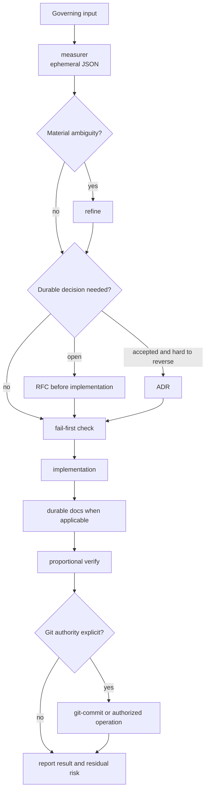

# Skill catalog contract

This declarative catalog describes ownership and agent-mediated composition. It is not a runtime state machine.

## Baseline composition

- Route software work through `measurer` first. Its JSON classification exists only in conversation and selects refinement, documentation, and review depth.
- Invoke `refine` only for material ambiguity. Size alone never triggers it: a defined `L/XL` task proceeds, while conflicting `S/M` behavior may require refinement.
- Use `tdd` for approved new behavior and `bugfix` for an existing defect. Both begin directly from sufficient governing input.
- Use `docs` only when knowledge must outlive the task. Prefer code and tests for local truth; use RFC, ADR, C4, API/operations docs, or postmortem at the appropriate time.
- Use `verify` at review or completion boundaries with the depth selected by `measurer`. It reports findings and residual risk in the final response; it creates no review files by default.
- Use `setup-baseline` only when explicitly requested to create, audit, or safely reconcile a repository-root `AGENTS.md`. It changes project instructions but never installs a runtime or overwrites a conflicting contract.
- Use `git-commit` only with explicit local commit authority. No workflow implies push, release, publication, deploy, or production authority.
- No matching skill means normal scoped work under repository instructions. Explicit-only skills never activate from broad similarity.

## Per-skill boundaries

| Skill | Owner | Input | Output | Stop |
| --- | --- | --- | --- | --- |
| `measurer` | Proportional classification and routing | Governing software task | Exact ephemeral JSON with size, drivers, refine, documentation, and review | Highest risk and smallest necessary routing are selected |
| `refine` | Material ambiguity | Incompatible interpretations plus repository evidence | Resolved choices and smallest open decision in conversation | Behavior, scope, constraints, authority, and verification seam are sufficient |
| `tdd` | Approved new behavior | Sufficient governing input | Fail-first test, minimal implementation, fresh results | Focused and nearby checks pass without scope drift |
| `bugfix` | Existing defect | Bug report and expected behavior | Reproduction, regression test, causal repair, focused review | Regression and nearest checks pass; residual risk is explicit |
| `verify` | Proportional review | Governing input, tests, complete diff, risks, fresh results | Findings, commands/results, residual risk, limitations | Findings are reconciled or reported honestly |
| `docs` | Durable knowledge | Shipped behavior, stable boundary, decision, incident, or non-obvious reason | Smallest appropriate docs surface or `ENG-NOTE` | Claims, links, timing, and examples are checked |
| `setup-baseline` | Project instruction foundation | Explicit request plus current repository evidence | Created, reconciled, or confirmed root `AGENTS.md` | Instructions are evidence-backed or a material conflict is awaiting a decision |
| `git-commit` | Atomic local commit | Explicit commit authority and reviewed task-owned changes | One local Conventional Commit | Post-commit state is reported; no remote action inferred |
| `ci-workflow` | CI mechanics and results | Expected checks, scripts, platform, trust boundaries | Least-privilege workflow and validation summary | Local syntax and available remote results are reported |
| `shape-domain` | Domain language and context boundaries | Conflicting terms, invariants, scenarios, integrations | Reconciled vocabulary and ownership guidance | Meanings and boundaries are coherent or explicitly open |
| `design-deep-modules` | Module boundary options | Governing behavior, callers, state, failures, contracts | Concrete interfaces, trade-offs, migration seams | Viable reversible options are explicit |
| `improve-architecture` | Architecture audit | Explicit request and current architecture | Prioritized evidence-backed findings | Findings remain separate from unapproved redesign |
| `decision-framework` | Material option selection | Viable options, drivers, evidence, authority | Transparent decision and revisit triggers | Selection is authorized or missing authority is explicit |
| `brainstorming` | Divergent exploration | Explicit open-ended exploration request | Options, tensions, experiments | The option space is useful enough to narrow |
| `premortem` | Failure forecast | Explicit proposed material change | Ranked failure chains and mitigations | High-leverage risks have detection and response proposals |
| `session-bridge` | Resumable handoff | Explicit handoff request and current state | Truthful compact continuation record | Another session can resume without invented completion |
| `technical-research` | Current technical evidence | Explicit uncertain technical question | Answer, sources, limitations, derived rule | The decision question is answered or uncertainty bounded |
| `security-review` | Security and authority risk | Security-relevant design, code, CI, or data flow | Prioritized findings, mitigations, residual risk | Material threats are addressed or awaiting explicit authority |

`brainstorming`, `git-commit`, `improve-architecture`, `premortem`, `session-bridge`, `setup-baseline`, and `technical-research` are explicit-only. All other skills may be selected implicitly when their descriptions match.
