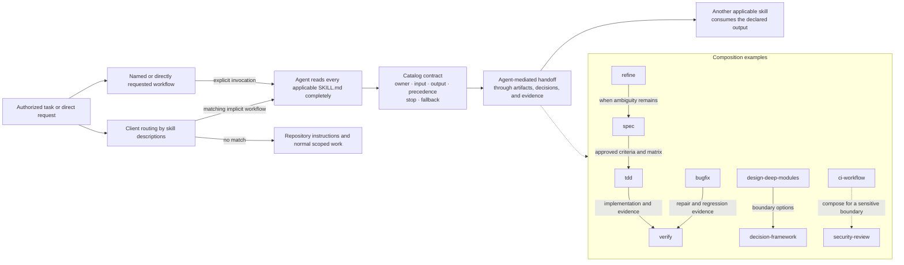
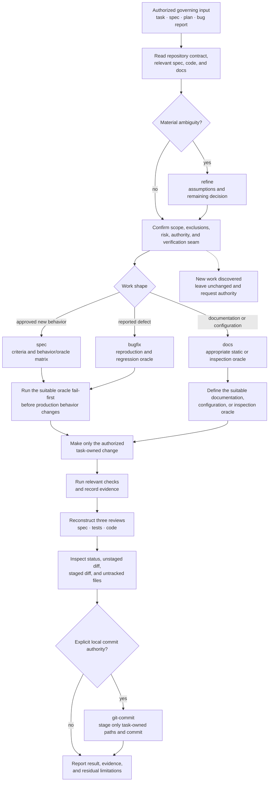
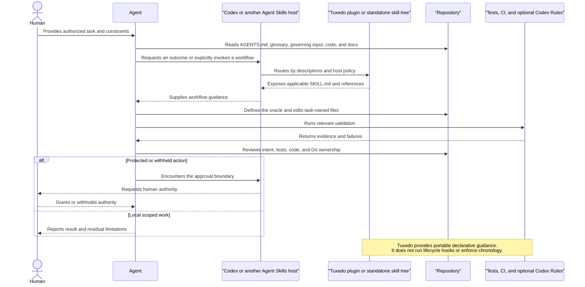

# Skill catalog contract

This is Tuxedo's declarative transition model. It describes ownership and composition; it is not a runtime state machine and does not mechanically enforce lifecycle order.

## Composition rules

- No matching skill: follow the repository instructions and perform normal scoped work. Do not force a skill merely to enter this table.
- Explicit-only skills run only when the user names or directly requests that workflow. They may compose with an implicit workflow after invocation, but never activate themselves from a broad similarity.
- Use client-provided descriptions for routing. Do not scan or open every installed `SKILL.md` to choose. Select the smallest complete set, then read every clearly applicable implicit skill and every explicitly invoked skill completely; do not substitute an unaided response for an applicable installed workflow.
- When intent is materially ambiguous, `refine` stabilizes the input before `spec`. When the request is approved and sufficient, skip `refine` and continue directly.
- `spec` owns the canonical behavior/oracle matrix. `verify` reviews the canonical matrix against the governing input and reports proposed corrections; it does not replace the matrix as a side effect of review.
- `design-deep-modules` owns boundary options and their consequences. `decision-framework` owns selection among viable material options when authority permits; it does not redesign the options while scoring them.
- For an approved new behavior, `tdd` owns fail-first implementation. For a reported defect, `bugfix` owns reproduction, the regression oracle, and repair.
- `ci-workflow` owns workflow mechanics and evidence production. `security-review` owns threat and trust-boundary analysis; compose them for a security-sensitive CI boundary.
- `docs` owns durable explanatory surfaces, not specifications, domain vocabulary, decisions still under consideration, or implementation.
- `verify` runs at the completion boundary before an explicitly authorized `git-commit`. A commit does not imply push, release, publication, or deploy authority.

## Contract views

These diagrams describe the catalog as an agent-mediated, declarative contract. Arrows represent decisions or artifact handoffs; they are not skill-to-skill runtime calls or a mechanically enforced state machine. Explicit-only workflows enter through direct invocation rather than broad similarity matching.

### How skills communicate

### How work proceeds

### How agents interact with Tuxedo

## Per-skill boundaries

| Skill | Owner | Input | Output | Precedence | Stop | Fallback |
| --- | --- | --- | --- | --- | --- | --- |
| `refine` | Decision-ready task input | Materially ambiguous request plus repository evidence | Resolved assumptions and smallest remaining decision | After explicit brainstorming and before spec; skip for approved sufficient work | Objective scope authority and verification seam are sufficient | Route to the applicable workflow or ask one material question |
| `brainstorming` | Divergent option exploration | Explicit request for broad exploration | Plausible directions and trade-offs | Explicit invocation takes precedence over narrowing by refine | Option space is useful enough to narrow or user stops exploration | Hand options to refine or decision-framework |
| `spec` | Governing specification and canonical behavior/oracle matrix | Authorized material objective and stabilized decisions | Criteria invariants exclusions classification authority and matrix | After needed refinement and before implementation | Criteria and oracle candidates are implementation-ready or explicitly blocked | Report unresolved decisions without inventing intent |
| `tdd` | Fail-first checks and implementation of approved new behavior | Approved criteria and independent oracle | Minimal passing implementation plus test evidence | After spec; yields to bugfix for an existing defect | Focused and relevant suites pass without scope drift | Return to spec when the oracle exposes ambiguity |
| `bugfix` | Defect reproduction regression oracle and repair | Reported or observed defect | Reproduction regression test minimal fix and evidence | Takes precedence over tdd for existing behavior regressions | Reproduction fails before and passes after the repair | Route to spec when intended behavior is genuinely unclear |
| `verify` | Review records and fresh execution evidence | Governing input canonical matrix tests implementation and diff | Separate spec test and code findings plus evidence | After implementation or for an explicit review; before commit | Findings are reconciled or residual risk is explicit | Report unavailable checks; never manufacture approval |
| `docs` | Smallest durable explanatory surface | Shipped behavior accepted decision or documentation request | Updated project docs ADR RFC architecture or postmortem | After the owning behavior or decision artifact is stable | Claims links examples and commands are verified proportionally | Follow stronger repository docs conventions |
| `git-commit` | Atomic local staged candidate and commit | Explicit commit authority and verified task-owned changes | One local Conventional Commit and inspected Git evidence | After verify; never before task ownership is clear | Local commit exists and post-commit state is reported | Stop on ambiguous staged ownership; do not push |
| `ci-workflow` | CI trigger permission job and evidence mechanics | Criteria repository commands platform and trust boundaries | Validated least-privilege workflow design or implementation | Compose with security-review for sensitive CI; does not own product security | Local syntax and available remote evidence are recorded | Follow target CI official docs and repository conventions |
| `shape-domain` | Domain vocabulary invariants and context boundaries | Conflicting language rules or model concepts | Reconciled glossary context map and naming guidance | Before spec or module design when domain meaning is unstable | Terms invariants and ownership boundaries are coherent | Record unresolved language instead of renaming blindly |
| `design-deep-modules` | Boundary options interfaces and migration seams | Domain behavior constraints callers and architecture evidence | Concrete module options and trade-offs | After domain shaping; before decision-framework when selection is material | Viable boundaries and reversible validation are explicit | Leave selection to decision-framework or authorized owner |
| `improve-architecture` | Evidence-backed architecture audit | Explicit request to inspect an existing architecture | Prioritized findings and improvement candidates | Explicit-only; precedes concrete boundary design when both are requested | Findings distinguish evidence from hypotheses and no edit was implied | Route accepted boundary work to design-deep-modules |
| `decision-framework` | Selection among established material options | Viable options drivers evidence uncertainty and authority | Decision matrix recommendation and revisit triggers | After option generation by refine brainstorming or design | Selection is authorized or the missing authority is explicit | Seek discriminating evidence or leave decision open |
| `premortem` | Pre-commit failure forecast and mitigation proposals | Explicit request plus proposed medium or high-risk change | Ranked failure chains mitigations and residual risks | Explicit-only; composes with domain or security specialists | High-leverage risks have owners detection and response proposals | Route security analysis to security-review |
| `session-bridge` | Truthful resumable handoff | Explicit session transition and current evidence | Compact state authority evidence and next-step handoff | Explicit-only at a real handoff boundary | Another session can resume without invented completion | Continue normally when no handoff exists |
| `technical-research` | Reproducible technical evidence record | Explicit current or uncertain technical question | Answer sources limitations derived rule and next check | Explicit-only; precedes a material decision when evidence is missing | Decision question is answered or uncertainty is bounded | Report repository evidence or request source access |
| `security-review` | Threat trust-boundary and residual-risk analysis | Security-relevant design code CI or authority boundary | Prioritized findings mitigations and residual risk | Takes precedence for security claims and composes with the owning workflow | Material threats are addressed or explicitly accepted by an authority | Mark unsupported claims needs-review rather than infer safety |
